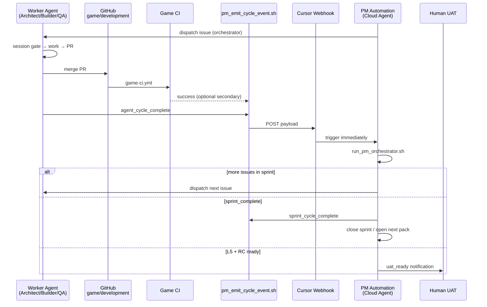

# Cloud Agent Setup Runbook — Event-Driven Multi-Agent Factory

**Version:** 1.0  
**Authority:** How to run Tides of Urashima on **Cursor Cloud Agents** until automated gates pass, then **notify human for UAT**.  
**Cross-refs:** `docs/PM_AGENT_RUNBOOK.md`, `docs/SPRINT_ORCHESTRATION.md`, `docs/GDAI_CLOUD_SETUP.md`, `game/data/qa/agent_cycle_events.json`, `.cursor/environment.json`

---

## 1. Goal

| You want | How this repo does it |
|----------|------------------------|
| Set up once | Cloud **environment snapshot** + Secrets + MCP dashboard |
| Agents run in sequence with quality gates | `sprint_board.json` + `run_pm_orchestrator.sh` + `run_agent_session_gate.sh` |
| **No daily/hourly cron** | **Event-driven PM** — next cycle starts when the **last cycle ends** |
| Stop for human | **L6 UAT** after L0–L5 on RC (`docs/PLAYTEST_SCRIPT.md`) |

**Rejected:** PM Automation on `0 9 * * *` (or any fixed interval). AI agents do not need sleep; wall-clock schedules waste time between cycles.

---

## 2. Architecture (event-driven)



### Cycle types

| Cycle | Ends when | Event emitted | What runs next |
|-------|-----------|---------------|----------------|
| **Micro** (one issue) | Issue `done` on board + PR merged/pushed | `agent_cycle_complete` | **PM** → orchestrator → next worker |
| **Sprint** | All sprint issues `done` | `sprint_cycle_complete` | **PM** → `pm_close_sprint.py` → new sprint pack |
| **Phase** | Phase exit gates PASS | `sprint_cycle_complete` + RC tag | **PM** → optional `uat_ready` after L5 |
| **UAT** | L0–L5 green on RC | `uat_ready` | **Human** only — not another worker |

Machine-readable: `game/data/qa/agent_cycle_events.json`

---

## 3. One-time setup

### 3.1 Cloud environment snapshot

**Dashboard:** [Cloud Agents → Environments](https://cursor.com/dashboard/cloud-agents/environments/r/github.com/vivivieri/3d-jrpg-adventure-pc-game)

Committed boot config:

```json
{
  "install": "bash tools/install_cloud_dev.sh",
  "start": "bash tools/ensure_mcp_stack.sh"
}
```

**Snapshot must include:**

- Godot 4.7 editor running (GDAI controls editor, not headless-only)
- `game/addons/gdai-mcp-plugin-godot/` (commercial — install before snapshot)
- Godotiq + MCP Pro built
- Blender, `uv`, Node
- `curl -sf http://127.0.0.1:3571/tools` returns JSON

See `docs/GDAI_CLOUD_SETUP.md` for plugin + panel **Start**.

### 3.2 Secrets (Cursor Cloud Agents → Secrets)

| Secret | Required when |
|--------|----------------|
| GDAI license / plugin | Phase 1+ scene work |
| `GAMELAB_API_KEY` | UI art MCP |
| `CURSOR_PM_CYCLE_WEBHOOK_URL` | **Event-driven PM** (copy from Automation webhook) |
| `OPENAI_API_KEY` / `GEMINI_API_KEY` | M5+ jury |
| `ELEVENLABS_API_KEY` | Phase 7 VO |
| `GH_TOKEN` | Optional: `repository_dispatch`, branch protection |

Also add `CURSOR_PM_CYCLE_WEBHOOK_URL` to **GitHub repo Secrets** if using `.github/workflows/agent-cycle-pm.yml`.

### 3.3 MCP (Cloud dashboard — required)

Register in **Dashboard → Integrations & MCP** (`.cursor/mcp.json` alone is not enough for cloud):

| Server | Role |
|--------|------|
| `godot-mcp` | GDAI build |
| `godotiq` | Debug |
| `godot-mcp-pro` | L4/L5 tests |
| `gamelab-mcp` | UI art |

Verify each agent boot:

```bash
bash tools/check_mcp_ready.sh
bash tools/check_extended_toolchain.sh
```

### 3.4 Branch bootstrap (first cycle)

On `game/development`:

1. Merge `main`
2. Complete **P1-00** (`game/project.godot`, tests, CI green)
3. File GitHub issues from `docs/sprints/Phase1-Sprint1-issues.md`

Until P1-00 is done, orchestrator dispatches PM only.

---

## 4. Cursor Automations (event-driven — NOT cron)

Create at [cursor.com/automations](https://cursor.com/automations).

### Automation A — **PM Sprint Master** (primary)

| Field | Value |
|-------|--------|
| **Name** | `PM — cycle dispatch` |
| **Trigger** | **Webhook** (copy URL → `CURSOR_PM_CYCLE_WEBHOOK_URL`) |
| **Repo** | `3d-JRPG-adventure-pc-game` |
| **Branch** | `game/development` (or environment) |
| **Tools** | MCP on, Comment on PR optional, Computer use on |

**Do not** add a schedule trigger.

**Prompt (paste):**

```text
You are PM Agent / Sprint Master for Tides of Urashima.

CONTEXT: You were triggered by a cycle-completion EVENT (not a timer).
Read artifacts/agent_cycle_event.json if present for issue_id, commit_sha, event type.

MANDATORY FIRST COMMAND:
  bash tools/run_pm_orchestrator.sh
If exit != 0: diagnose, escalate via bash tools/pm_emit_escalation.sh, STOP.

Follow docs/PM_AGENT_RUNBOOK.md exactly.

AFTER orchestrator PASS, read artifacts/pm_orchestrator_report.json → next_dispatch:

1. If event was agent_cycle_complete or ci_cycle_complete:
   - Verify previous issue is done on sprint_board.json
   - If next_dispatch empty and sprint_complete: emit sprint_cycle_complete (see below)
   - Else: start the NEXT worker agent work OR post clear dispatch comment on GitHub issue
     with: bash tools/run_agent_session_gate.sh <role> <issue_id>

2. If you complete PM-owned work (e.g. P1-00 bootstrap) in this session:
   python3 tools/pm_update_issue.py <id> --status done --commit $(git rev-parse HEAD)
   bash tools/pm_emit_cycle_event.sh agent_cycle_complete --issue <id> --agent pm --commit $(git rev-parse HEAD)

3. If sprint_complete and event sprint_cycle_complete:
   python3 tools/pm_close_sprint.py --next-sprint-number <N>  (dry-run first if unsure)
   Update docs/sprints/ + sprint_board.json; clear carry_over_queue
   bash tools/pm_emit_cycle_event.sh agent_cycle_complete --issue <first-issue-new-sprint> --agent pm

4. If phase exit + L5 PASS on RC commit:
   bash tools/pm_emit_cycle_event.sh uat_ready --tag <tag> --commit <sha>
   STOP — notify human for docs/PLAYTEST_SCRIPT.md (L6). Do not start new workers.

NEVER: skip orchestrator, mark gates PASS without QA evidence, use cron logic.
```

### Automation B — **CI failure triage** (optional)

| Trigger | **CI completed** — workflow `Game CI` — **failure** on `game/development` |
| Prompt | Run remediation; `bash tools/qa_emit_remediation.sh`; assign Architect/Builder; do not dispatch PM on success (worker emits cycle event) |

### Automation C — **Human UAT notify** (end of pipeline)

| Trigger | **Webhook** separate URL, or manual |
| Event | `uat_ready` only |
| Prompt | Post Slack/email/checklist link to `docs/PLAYTEST_SCRIPT.md`; do not run game code |

---

## 5. End-of-cycle contract (every worker agent)

Every **non-PM** agent session **must** end with:

```bash
# 1. Gates on PR commit
bash tools/run_ci_checks.sh          # or confirm CI green on PR

# 2. Board update (PM may do this if same session — otherwise worker requests PM)
python3 tools/pm_update_issue.py P1-02 --status done --commit "$(git rev-parse HEAD)"

# 3. EVENT — triggers PM immediately (no waiting for tomorrow)
bash tools/pm_emit_cycle_event.sh agent_cycle_complete \
  --issue P1-02 \
  --agent builder \
  --commit "$(git rev-parse HEAD)"
```

If step 3 is skipped, **the factory stalls** — there is no hourly PM to pick it up.

### PM after dispatching work

If PM only **assigns** another Cloud Agent (does not do the work itself), PM session ends with:

```bash
# Optional: confirm dispatch recorded
python3 tools/pm_update_issue.py P1-01 --status in_progress --agent architect
# Do NOT emit agent_cycle_complete — the worker emits when done
```

---

## 6. Event reference

| Event | When to emit | Command |
|-------|--------------|---------|
| `agent_cycle_complete` | Worker or PM finished one issue | `pm_emit_cycle_event.sh agent_cycle_complete --issue … --agent …` |
| `sprint_cycle_complete` | Orchestrator `sprint_complete: true` | `pm_emit_cycle_event.sh sprint_cycle_complete --sprint … --next-sprint N` |
| `ci_cycle_complete` | Optional; CI workflow after merge | Automatic via `agent-cycle-pm.yml` if `.cycle_pending` marker exists |
| `uat_ready` | L5 PASS + RC tagged | `pm_emit_cycle_event.sh uat_ready --tag v0.1.0-rc1` |
| `mcp_blocked` | MCP stack down | `pm_emit_cycle_event.sh mcp_blocked --check check_mcp_ready.sh` |

Payload schema: `game/data/qa/agent_cycle_events.json`

---

## 7. GitHub workflow (secondary path)

`.github/workflows/agent-cycle-pm.yml`:

- **Primary:** `repository_dispatch` from `pm_emit_cycle_event.sh` (when `gh` available)
- **Secondary:** `workflow_run` after **Game CI** success **only if** `artifacts/.cycle_pending` exists (prevents idle CI→PM loops)

Add repo secret: `CURSOR_PM_CYCLE_WEBHOOK_URL` (same URL as Cursor Automation webhook).

---

## 8. Full factory timeline (example Phase 1)

| Step | Actor | Action |
|------|-------|--------|
| 0 | You | One-time snapshot + secrets + Automation A webhook |
| 1 | You | Manual PM run OR `pm_emit_cycle_event.sh` with `agent_cycle_complete` bootstrap |
| 2 | PM | `run_pm_orchestrator.sh` → dispatch **P1-00** |
| 3 | PM/Architect | P1-00 bootstrap → emit `agent_cycle_complete` |
| 4 | PM (webhook) | dispatch **P1-01** Architect |
| 5 | Architect | session gate → shaders → PR → emit event |
| 6 | PM (webhook) | dispatch **P1-02** Builder |
| … | … | repeat until `sprint_complete` |
| N | PM | `sprint_cycle_complete` → Phase1-Sprint2 |
| … | … | phases 1–6 automated L0–L5 |
| End | PM | `uat_ready` → **you** run L6 playtest |

---

## 9. Anti-patterns

| Do not | Why |
|--------|-----|
| Cron PM every N hours | Wastes time between AI cycles |
| Worker starts without session gate | Breaks sequence enforcement |
| Skip `pm_emit_cycle_event.sh` | PM never wakes up |
| PM does Builder `.tscn` work | R&R violation |
| Automate L6 playtest | Required human ship gate |
| Rely on `.cursor/mcp.json` only in cloud | Dashboard registration required |

---

## 10. Troubleshooting

| Symptom | Fix |
|---------|-----|
| Factory stalled after PR merge | Worker forgot `pm_emit_cycle_event.sh` — run manually with last issue id |
| Webhook 401/404 | Re-copy Automation webhook URL to Secrets |
| PM runs but MCP FAIL | Fix snapshot; emit `mcp_blocked`; human fixes secrets |
| CI→PM loop | Ensure `.cycle_pending` cleared; use guarded workflow only |
| Orchestrator dispatch empty, sprint not done | Check `depends_on` / issue status on `sprint_board.json` |

---

## 11. Quick start checklist

- [ ] Environment snapshot with GDAI + MCP PASS  
- [ ] Secrets: GDAI, GameLab, `CURSOR_PM_CYCLE_WEBHOOK_URL`  
- [ ] MCP servers in Cloud dashboard  
- [ ] **Automation A** — webhook trigger only (no schedule)  
- [ ] GitHub secret `CURSOR_PM_CYCLE_WEBHOOK_URL` for workflow  
- [ ] `game/development` bootstrapped (P1-00)  
- [ ] First event: `bash tools/pm_emit_cycle_event.sh agent_cycle_complete --issue P1-00 --agent pm`  
- [ ] Confirm PM Automation starts within seconds, not next day  

---

## 12. Cross-refs

- `docs/PM_AGENT_RUNBOOK.md` — PM step list inside each triggered run  
- `docs/SPRINT_ORCHESTRATION.md` — board + gates  
- `docs/ENVIRONMENTS.md` — dev → qa → **uat** promotion  
- `AGENTS.md` — cloud bootstrap  
- `docs/GDAI_CLOUD_SETUP.md` — editor + HTTP :3571
