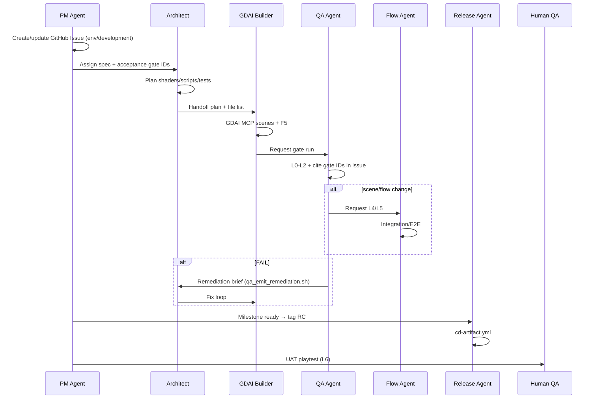

# Multi-Agent Team — Simulated Small Studio

**Version:** 1.0  
**Applies to:** `game/development` implementation on Cursor Cloud Agents  
**Cross-refs:** `.cursorrules` §0, `docs/MCP_STACK.md`, `docs/ENVIRONMENTS.md`, `docs/PROJECT_MANAGEMENT.md`, `docs/AGILE_WITHIN_PHASES.md`, `docs/AI_DEV_WORKFLOW.md`

---

## 1. Why multi-agent

One agent doing plan + build + test + deploy violates R&R and skips gates. This doc defines **roles** that map to **tools** and **handoffs** — simulating a 6-person indie team.

---

## 2. Team roster

| Role | Agent name | Primary tools | Owns | Must NOT |
|------|------------|---------------|------|----------|
| **Product / PM** | PM Agent | GitHub Issues, optional Linear/Notion MCP | Milestones, issue triage, env promotion | Write `.tscn` or game code |
| **Tech Lead / Architect** | GodotPrompter | Cursor, `docs/`, `game/data/` | Plans, `.gd`, `.gdshader`, unit tests, refactors | Hand-edit scenes |
| **Gameplay Builder** | GDAI Builder | `godot-mcp` (GDAI) | `.tscn`, materials, lights, F5 | Replace architect for system design |
| **QA Engineer** | QA Agent | `run_ci_checks.sh`, `run_playtest_smoke.sh`, jury scripts | L0–L2 gates, evidence paths, bug reports | Mark ship without gates |
| **Integration Tester** | Flow Agent | `godot-mcp-pro`, `run_integration_tests.sh`, `run_e2e_playthrough.sh` | L4/L5 scenarios, asserts | Build scenes |
| **Debugger** | Analyze Agent | `godotiq` | Signals, `trace_flow`, debug console | Scene mutations |
| **Release Engineer** | Release Agent | `run_cd_gates.sh`, tags, CD workflows | RC/beta/prod tags, export | Feature implementation |
| **Art Reviewer** | Visual Agent | `docs/ART_DIRECTION.md`, palette/jury tools | L2 visual/model/audio jury evidence | Bypass jury with "looks fine" |
| **Human QA Lead** | Human | `docs/PLAYTEST_SCRIPT.md` | L6 UAT sign-off | Before L0–L5 pass |

---

## 3. Session lifecycle (one feature)



---

## 4. Handoff contracts

### Architect → Builder

Must include:
- Design doc section (e.g. `ENVIRONMENT_KITS.md` row)
- Node tree outline
- Shader/uniform list
- Properties to set in inspector (GDAI applies)
- Target gate IDs (e.g. `L2_scene_primitives`, `L2_visual_palette`)

### Builder → QA

Must include:
- `game/scenes/.gdai_built` updated (`verified_f5=true`)
- Commit SHA
- Screenshot paths under `artifacts/screenshots/` if visual
- List of scenes touched

### QA → PM (pass)

```markdown
## Gate report
- Commit: abc1234
- L0_rr_compliance: PASS
- L1_unit_tests: PASS
- L2_scene_primitives: PASS
- L2_visual_palette: PASS (avg_anchor_dist=72)
- Evidence: artifacts/screenshots/ruined_village_gameplay.png
```

### QA → Architect (fail)

Run: `bash tools/qa_emit_remediation.sh <brief-id>`  
Post remediation JSON + gate ID in issue.

---

## 5. Parallel agent patterns

| Situation | Agents in parallel |
|-----------|-------------------|
| Zone art + combat tuning | Architect (combat JSON) ∥ Builder (zone scene) — **different files** |
| Visual jury + integration | QA Agent (jury) ∥ Flow Agent (L4) — after Builder handoff |
| Doc update + implementation | PM (main branch docs) ∥ Builder (`game/development`) |

**Never parallel two agents on the same `.tscn`** — GDAI MCP single-writer.

---

## 6. Environment × agent matrix

| Environment | Lead agent | Supporting agents |
|-------------|------------|-------------------|
| Design (`main`) | PM | Architect (data JSON only) |
| Development | Architect + Builder | Debugger on demand |
| QA | QA Agent | Flow Agent for L4+ |
| UAT | PM + Human | Release Agent (artifact) |
| Preprod | Release Agent | QA Agent (gate verify) |
| Production | Release Agent | PM (sign-off) |

---

## 7. Cloud agent startup (every role)

```bash
bash tools/ensure_mcp_stack.sh
bash tools/check_mcp_ready.sh          # Builder, Flow, Debugger
bash tools/check_rr_compliance.sh      # All roles touching game/
```

**PM-only session** (docs/issues on `main`):
```bash
bash tools/run_docs_ci_checks.sh
```

---

## 8. Subagent invocation (Cursor)

| Task | Subagent type | Model hint |
|------|---------------|------------|
| Codebase search | `explore` | — |
| PR / diff review | `bugbot` | readonly |
| Security on export/CD | `security-review` | readonly |
| Broad zone implementation | `generalPurpose` | with full handoff doc |

Resume agents only for **same role continuation** (e.g. Builder session 2 on same scene).

---

## 9. Definition of done (per issue)

- [ ] Acceptance gate IDs listed in issue and **all PASS**
- [ ] Evidence paths in issue or PR
- [ ] No `WARN` or `SKIP` counted as pass for milestone gates
- [ ] Issue labels updated: `status/done`, env label retained for audit
- [ ] PR merged to correct branch (`main` = docs only; `game/development` = code)

---

## 10. Cross-refs

- `docs/PROJECT_MANAGEMENT.md` — GitHub Issues + MCP
- `docs/AGILE_WITHIN_PHASES.md` — sprint cadence inside each phase
- `docs/ENVIRONMENTS.md` — dev/qa/uat/preprod/prod
- `docs/QA_REMEDIATION_LOOP.md` — fix iteration rules
- `AGENTS.md` — cloud bootstrap
