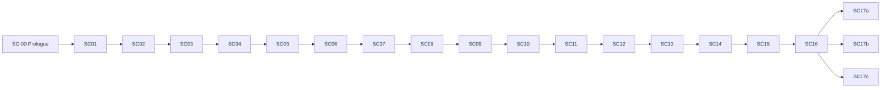

# Tides of Urashima — Storyboard

**Format per scene:** ID, location, camera, dialogue summary, gameplay type, mood, assets needed.

**Total scenes:** 19 (SC-00 prologue + 18 main path)

**Related docs:** `docs/CINEMATICS.md`, `docs/CHARACTER_BIBLE.md`, `docs/ENVIRONMENT_KITS.md`, `docs/TUTORIAL_DESIGN.md`, `docs/ENDING_DESIGN.md`, `docs/PACING_CHART.md`

---

## Act I — The Return

### SC-00 — Prologue: The Rescue (new)
| Field | Detail |
|-------|--------|
| **Location** | Black / montage — sea, palace silhouette |
| **Camera** | Slow fades; letterbox optional |
| **Summary** | Urashima saves wounded kappa-turtle spirit. Brief Dragon Palace visit. Otohime gives lacquer box. "Three days." |
| **Gameplay** | Non-interactive; skippable after 3s (hold Confirm after first play) |
| **Mood** | Mythic, fateful |
| **Assets** | Kappa-turtle spirit silhouette, box, palace gold flash |
| **Flag** | `prologue_seen` |

### SC-01 — Arrival at the Shore
| Field | Detail |
|-------|--------|
| **Location** | Beach outside ruined village |
| **Camera** | Wide establishing shot → over-shoulder follow |
| **Summary** | Urashima washes ashore, clutching the lacquer box. Voice-over: "I thought it was three days." |
| **Gameplay** | Tutorial movement (WASD), approach village gate |
| **Mood** | Lonely, grey sky, distant thunder |
| **Assets** | Beach terrain, driftwood, box prop, ruined gate silhouette |
| **Camera** | See `CINEMATICS.md` SC-01 — wide establishing → follow |

### SC-02 — Empty Village
| Field | Detail |
|-------|--------|
| **Location** | Ruined Fishing Village (hub) |
| **Camera** | Slow pan across submerged houses |
| **Summary** | No people. Banners rotting. A child's sandal floats in a puddle. Urashima: "Anyone...?" |
| **Gameplay** | Free exploration; interact with 3 inspect points (banner, sandal, well) |
| **Mood** | Dread, silence broken by wind |
| **Assets** | Modular ruin kit (`village_*`), water puddles, interactable highlights |
| **Camera** | 4s hub pan on first enter (`CINEMATICS.md` SC-02) |

### SC-03 — The Cracked Torii
| Field | Detail |
|-------|--------|
| **Location** | Village shrine |
| **Camera** | Low angle up at broken torii |
| **Summary** | Spirit voice (Yuzu, unseen): "You left. We waited." Urashima recognizes the shrine. |
| **Gameplay** | Dialogue sequence; quest flag `met_yuzu_spirit` |
| **Mood** | Accusatory, spiritual |
| **Assets** | `village_torii_damaged` (hero prop), spirit particle VFX |
| **Camera** | Low angle up torii (`CINEMATICS.md`) |

### SC-04 — Roku's Warning
| Field | Detail |
|-------|--------|
| **Location** | Half-collapsed diver's shack |
| **Camera** | Interior two-shot |
| **Summary** | Old man Roku emerges. "That box isn't a gift. Don't open it." Hints at Tidal Caves path. |
| **Gameplay** | Dialogue + receive map item; unlock cave entrance |
| **Mood** | Urgent, gravelly wisdom |
| **Assets** | `village_shack_roku` interior, Roku model, map UI icon |

### SC-05 — First Blood (Combat Tutorial)
| Field | Detail |
|-------|--------|
| **Location** | Village outskirts path |
| **Camera** | Standard encounter transition (swirl) |
| **Summary** | A **Salt Crab** blocks the path — "even the sea forgets you." |
| **Gameplay** | Tutorial combat: Attack, Skill, Defend; guaranteed win |
| **Mood** | Tense → empowering |
| **Assets** | Salt Crab model + portrait, combat UI, tutorial prompts |
| **Gameplay note** | Limit gauge visible; tutorial optional |

---

## Act II — The Depths

### SC-06 — Tidal Caves Entrance
| Field | Detail |
|-------|--------|
| **Location** | Cave mouth below cliffs |
| **Camera** | Tracking shot into darkness |
| **Summary** | Bioluminescent algae. Distant bell sound (palace echo). |
| **Gameplay** | Enter dungeon; lighting shift |
| **Mood** | Wonder tinged with wrongness |
| **Assets** | Cave entrance, algae emissive textures, ambient audio |

### SC-07 — Water Level Puzzle
| Field | Detail |
|-------|--------|
| **Location** | Tidal Caves — flooded chamber |
| **Camera** | Top-down wide for puzzle readability |
| **Summary** | Urashima must raise/lower water to reach an ancient latch. |
| **Gameplay** | Switch puzzle (2 states); optional chest with antidote |
| **Mood** | Quiet problem-solving |
| **Assets** | Water plane animation, switch props, chest |

### SC-08 — Echo of the Drowned
| Field | Detail |
|-------|--------|
| **Location** | Tidal Caves — deep pool |
| **Camera** | Close on water surface reflection |
| **Summary** | Faces appear beneath the water. Voices overlap: "Why didn't you come back?" |
| **Gameplay** | Dialogue + forced encounter (2x Tide Wraith) |
| **Mood** | Horror, guilt |
| **Assets** | Wraith VFX, underwater face decals, echo audio |

### SC-09 — Boss: Shore Wraith
| Field | Detail |
|-------|--------|
| **Location** | Tidal Caves — boss arena |
| **Camera** | Low dramatic angle; boss intro pan |
| **Summary** | Colossal wraith forms from pooled regret. "You chose her over us." |
| **Gameplay** | Boss fight; teaches intent UI and phase change at 50% HP |
| **Mood** | Confrontational, tragic |
| **Assets** | Shore Wraith boss model, arena (`cave_boss_arena_ring`), boss HP bar |
| **Gameplay note** | Urashima **solo** fight; Yuzu joins after (SC-10) |
| **Camera** | 5s boss intro (`CINEMATICS.md`) |

### SC-10 — Yuzu Joins
| Field | Detail |
|-------|--------|
| **Location** | Tidal Caves — shrine alcove |
| **Camera** | Soft focus; spirit materialize |
| **Summary** | Yuzu appears fully. "I can't rest until the tide is answered." Joins party. |
| **Gameplay** | Party member unlock; skill tutorial (Heal) |
| **Mood** | Melancholy resolve |
| **Assets** | Yuzu model, join fanfare SFX, party UI update |
| **VFX** | Materialize from torii shards (2s) |

### SC-11 — Palace Vision (Flashback)
| Field | Detail |
|-------|--------|
| **Location** | Overlay on cave wall (ethereal) |
| **Camera** | Dreamlike slow dolly |
| **Summary** | Otohime: "Stay, and the world will not touch you." Urashima almost agrees. |
| **Gameplay** | Non-interactive cutscene (skippable) |
| **Mood** | Seductive, too perfect |
| **Assets** | Palace gold materials, Otohime silhouette/bust, harp audio |
| **Camera** | Letterbox 2.39:1; skippable after 3s |

### SC-12 — Dragon Palace Gate
| Field | Detail |
|-------|--------|
| **Location** | Dungeon 2 entrance — impossible architecture |
| **Camera** | Vertigo tilt up massive gate |
| **Summary** | Gate floats above water. Roku arrives (if not in party, joins here). "This is where time was stolen." |
| **Gameplay** | Party complete; save point; enter dungeon |
| **Mood** | Awe, scale |
| **Assets** | `palace_gate_main` (hero), skybox shift, Roku join if needed |
| **Camera** | Vertigo tilt up gate (`CINEMATICS.md` SC-12) |
| **Scope** | No reverse-gravity rooms in v1 — floating walkways only |

---

## Act III — The Tide

### SC-13 — The Truth of the Box
| Field | Detail |
|-------|--------|
| **Location** | Gate interior — mirror chamber |
| **Camera** | Mirror reflection shows young AND old Urashima |
| **Summary** | Roku: "The box holds their years. Open it, they live — you won't." |
| **Gameplay** | Dialogue choice (recorded, not branching yet); quest `knows_box_truth` |
| **Mood** | Heavy revelation |
| **Assets** | `palace_mirror_chamber`, mirror shader, dual character lighting |
| **Camera** | Young + old Urashima in reflection (`CINEMATICS.md` SC-13) |

### SC-14 — Palace Sentinel
| Field | Detail |
|-------|--------|
| **Location** | Gate — sentinel hall |
| **Camera** | Boss intro |
| **Summary** | Armored guardian: "No mortal leaves with stolen time." |
| **Gameplay** | Miniboss; weak to Spirit element (Yuzu) |
| **Mood** | Epic, disciplined |
| **Assets** | Palace Sentinel model (ryūgū armor), sentinel hall |
| **Gameplay note** | Spirit weakness tutorial for Yuzu |

### SC-15 — Tide Keeper Confrontation
| Field | Detail |
|-------|--------|
| **Location** | Gate — throne of tides |
| **Camera** | Circular arena; camera orbits during phase 2 |
| **Summary** | Tide Keeper: "Paradise is mercy." Urashima: "Mercy that drowns the world isn't mercy." |
| **Gameplay** | Final boss (3 phases); at 10% HP, combat pauses for choice prompt |
| **Mood** | Cathartic, cosmic |
| **Assets** | Tide Keeper boss, tide VFX, phase transition audio |
| **Camera** | 6s intro; slow orbit phase 2 (`CINEMATICS.md`) |

### SC-16 — The Choice
| Field | Detail |
|-------|--------|
| **Location** | Same arena (time frozen) |
| **Camera** | Close on Urashima's face; UI choice overlay |
| **Summary** | Three options presented with no timer. |
| **Gameplay** | Branching ending selection |
| **Mood** | Stillness |
| **Assets** | Choice UI, box glow intensify |
| **Camera** | Close on Urashima; combat frozen (`CINEMATICS.md` SC-16) |

### SC-17a — Ending: Rewind
| Field | Detail |
|-------|--------|
| **Location** | Village — restored variant |
| **Camera** | Crane up from festival (`CINEMATICS.md` — 15s total) |
| **Summary** | Village lives again. Urashima's figure dissolves at the edge of the crowd. Yuzu feels a breeze. |
| **Gameplay** | Credits roll |
| **Mood** | Bittersweet |
| **Assets** | `village_restored_kit`, `village_festival_lantern_row`, `village_crowd_silhouettes` (8–12), credits |

### SC-17b — Ending: Anchor
| Field | Detail |
|-------|--------|
| **Location** | Village shore — dawn |
| **Camera** | Wide rebuild shot → sapling close (`CINEMATICS.md`) |
| **Summary** | Spirits fade into the land. Roku plants a new sapling. Urashima stays, older but present. |
| **Gameplay** | Credits roll |
| **Mood** | Hopeful |
| **Assets** | `shore_dawn_skybox`, `prop_sapling_new`, `rebuilder_figures` (×3), spirit dissolve VFX |

### SC-17c — Ending: Drift
| Field | Detail |
|-------|--------|
| **Location** | Open sea |
| **Camera** | Pull back from lone boat; underwater palace glimpse (`CINEMATICS.md`) |
| **Summary** | Urashima rows toward horizon. Otohime's palace glimmers beneath the waves. Cycle continues. |
| **Gameplay** | Credits roll |
| **Mood** | Tragic, open |
| **Assets** | `boat_urashima`, endless sea plane, `palace_underwater_glimpse` |

---

## Scene flow diagram

---

## Production priority (pre-build → art rebuild)

### Phase 0 — Design lock (complete)
- [x] GDD, storyboard, art bible
- [x] Character bible, environment kits, boss designs, encounter table, cinematics
- [x] Quest/flags, tutorial, ending, economy, combat, skills, UI, save, puzzle, achievements, playtest

### Phase 1 — Vertical art slice
1. SC-02 Ruined Village hub (`village_torii_damaged`, shack, well, Urashima model)
2. SC-05 tutorial combat (Salt Crab model + portraits)

### Phase 2 — Act II art
3. SC-06–09 Tidal Caves + Shore Wraith boss
4. SC-10 Yuzu model + join VFX

### Phase 3 — Act III art
5. SC-12–16 Palace gate, mirror, Sentinel, Tide Keeper, choice UI
6. SC-17a/b/c ending environments

### Legacy greybox order (prototype branches only)
1. SC-01, SC-02, SC-05 (movement + first fight)
2. SC-06, SC-09 (dungeon + boss template)
3. SC-15, SC-16 (final boss + choice UI)
4. Remaining scenes as content pass
