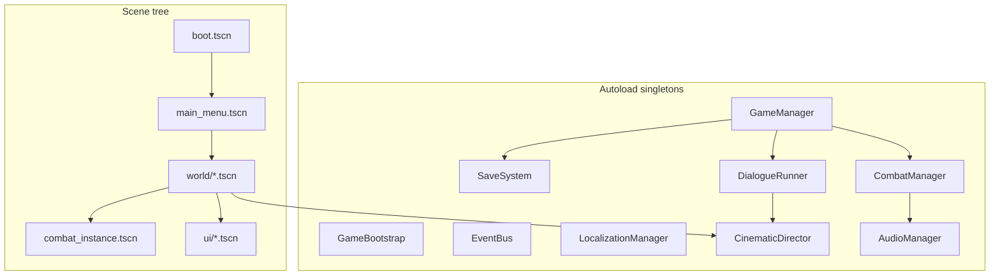
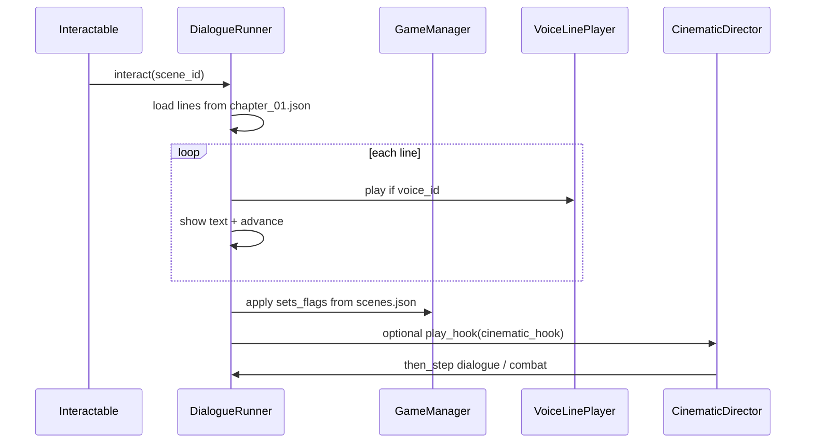
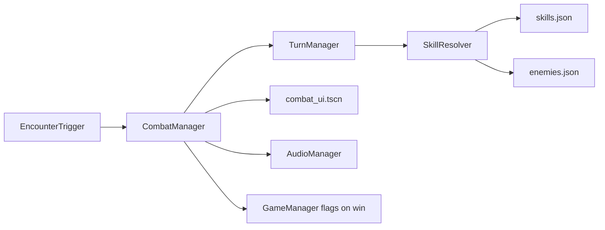

# Tides of Urashima — Technical Design Document (TDD)

**Version:** 1.1  
**Engine:** Godot 4.7 stable, Forward+  
**Architecture:** Scene-tree JRPG with autoload singletons — **not** ECS  
**Status:** Pre-build spec — Phase 2+ implementation  
**Cross-refs:** [CODE_STYLE.md](CODE_STYLE.md), [CODE_BASE_CLASS_RULES.md](CODE_BASE_CLASS_RULES.md), [DATA_ARCHITECTURE.md](DATA_ARCHITECTURE.md), [SAVE_AND_FAIL_STATES.md](SAVE_AND_FAIL_STATES.md), [UI_UX_FLOW.md](UI_UX_FLOW.md), [COMBAT_SYSTEMS.md](COMBAT_SYSTEMS.md)

---

## 1. Design principles

| Principle | Detail |
|-----------|--------|
| **Data-driven** | Combat, dialogue, quests, encounters live in `game/data/*.json` |
| **Story spine first** | `scenes.json` → flags → quests → content (`DATA_ARCHITECTURE.md`) |
| **Thin scenes, fat autoloads** | Zone `.tscn` files place geometry + triggers; systems live in autoloads |
| **Extend base classes** | `PlayerController`, `Combatant`, `Interactable` — see `CODE_BASE_CLASS_RULES.md` |
| **Signals over polling** | `EventBus` for cross-system events; typed `.connect()` only |
| **No FMV** | Cinematics = `Camera3D` + `CinematicDirector` + audio (`CINEMATICS.md`) |
| **Single save slot v1** | `user://save_slot_0.json` — schema in `SAVE_AND_FAIL_STATES.md` |

---

## 2. Runtime architecture



### Autoload registry (target — Phase 2+)

| Autoload | Script | Responsibility |
|----------|--------|----------------|
| `GameBootstrap` | `scripts/core/game_bootstrap.gd` | Startup JSON path checks ✅ exists |
| `GameManager` | `scripts/core/game_manager.gd` | Flag state, scene progression, `load_json()` API |
| `EventBus` | `scripts/core/event_bus.gd` | Global signals (locale, combat, story) |
| `SaveSystem` | `scripts/core/save_system.gd` | Serialize/deserialize save slot |
| `LocalizationManager` | `scripts/core/localization_manager.gd` | Locale, CSV, font routing |
| `AudioManager` | `scripts/audio/audio_manager.gd` | BGM crossfade, SFX, bus ducking |
| `DialogueRunner` | `scripts/narrative/dialogue_runner.gd` | Line playback, choices, `voice_id` → `VoiceLinePlayer` |
| `CombatManager` | `scripts/combat/combat_manager.gd` | Battle lifecycle, links UI + turn system |
| `CinematicDirector` | `scripts/story/cinematic_director.gd` | Hook registry, gating, `then` chain ✅ partial |

**Today:** `GameBootstrap`, `CinematicDirector` registered; scenes and runtime UI via **GDAI MCP only** (Phase 2+).

### 2.1 Code base classes (extend-only)

Gameplay entities **extend** Architect-owned scripts — Builder instantiates component `.tscn` prefabs, never forks new controller stacks.

| `class_name` | Script | Instanced by |
|--------------|--------|--------------|
| `PlayerController` | `scripts/exploration/player_controller.gd` | `player.tscn` |
| `Combatant` | `scripts/combat/combatant.gd` | Enemy/party prefabs |
| `Interactable` | `scripts/exploration/interactable.gd` | `interactable_*.tscn` catalog |
| `SavePoint` | `scripts/exploration/save_point.gd` | `save_point.tscn` |

**Registry:** `game/data/code/base_classes.json` · **Rules:** `docs/CODE_BASE_CLASS_RULES.md` · **Component catalog:** `docs/LEVEL_DESIGN.md` §1b · **CI:** `L0_base_classes`, `L0_base_class_compliance`, `L1_gdscript_lint`.

---

## 3. Scene flow

```mermaid
stateDiagram-v2
    [*] --> Boot
    Boot --> MainMenu
    MainMenu --> Prologue: New Game
    MainMenu --> Field: Continue
    Prologue --> BeachShore: SC-00 done
    BeachShore --> RuinedVillage
    RuinedVillage --> TidalCaves: cave_entrance_unlocked
    TidalCaves --> PalaceGate: wraith_pearl + yuzu_joined (SC-10); SC-11 flashback optional before SC-12
    PalaceGate --> EndingZone: SC-16 choice
    EndingZone --> Credits
    Credits --> MainMenu
```

| Transition | Owner | Mechanism |
|--------------|-------|-----------|
| Boot → menu | `boot_scene.gd` | Scene change after data OK |
| Menu → game | `GameManager` | New Game loads `beach_shore.tscn` + SC-00 hook |
| Zone → zone | `ZoneTransition` Area3D | `GameManager.change_zone(zone_id, spawn_marker)` |
| Field → combat | `EncounterTrigger` | `CombatManager.start_encounter(encounter_id)` |
| Combat → field | `CombatManager` | Victory/defeat signal → restore field scene state |
| Field → dialogue | `Interactable` | `DialogueRunner.start(scene_id)` |
| Cinematic | `CinematicDirector` | `play_hook(hook_id)` → camera markers → `then` steps |

**Scene paths (canonical):**

```
res://scenes/boot.tscn
res://scenes/ui/main_menu.tscn
res://scenes/world/beach_shore.tscn
res://scenes/world/ruined_village.tscn
res://scenes/world/tidal_caves.tscn
res://scenes/world/dragon_palace_gate.tscn
res://scenes/world/ending_rewind.tscn
res://scenes/world/ending_anchor.tscn
res://scenes/world/ending_drift.tscn
res://scenes/combat/combat_instance.tscn
res://scenes/ui/dialogue_box.tscn
res://scenes/ui/combat_ui.tscn
```

---

## 4. Data loading

### API (Phase 2)

```gdscript
# GameManager — single entry for JSON
static func load_json(path: String) -> Variant:
    # Delegates to StoryData.load_json today; merge into GameManager
    ...

func get_flag(name: String) -> Variant:
    return _flags.get(name, false)

func set_flag(name: String, value: Variant) -> void:
    _flags[name] = value
    EventBus.flag_changed.emit(name, value)
```

### Load order at New Game

1. `starting/new_game.json` — party, inventory, default flags  
2. `story/scenes.json` — validate spine (dev/QA)  
3. `story/flags.json` — registry (validation only at runtime)  
4. Zone scene + `ZoneVisuals.apply(zone_id)`  

### Content resolution

| Player action | Lookup |
|---------------|--------|
| Talk to NPC | `dialogue/chapter_01.json` key = `scene_id` |
| Start fight | `encounters/story_encounters.json` by `encounter_id` |
| Use skill | `skills/skills.json` by `skill_id` |
| Shop buy | `shop/roku_shop.json` |
| Quest update | `quests/main_quests.json` stages vs `GameManager` flags |

**Validation:** `python3 tools/validate_story_data.py` before every commit touching `game/data/`.

---

## 5. Save / load pipeline

```
[Gameplay mutation]
    → GameManager flags / party / inventory
    → SaveSystem.mark_dirty()
    → (autosave trigger: zone transition | quest stage | manual well)
    → SaveSystem.write_slot(0)
    → user://save_slot_0.json
```

| Event | Autosave? |
|-------|-----------|
| Zone transition | Yes |
| Quest stage complete | Yes |
| Manual well | Yes + full heal (first visit) |
| Mid-combat | **No** |
| Before boss (SC-09, SC-14, SC-15) | Yes (pre-fight) |

**Continue:** `SaveSystem.read_slot(0)` → restore scene path + `spawn_marker` + all persisted fields (`SAVE_AND_FAIL_STATES.md` §2).

**Steam cloud (Phase 8):** Same JSON blob via GodotSteam `fileWrite` — path abstraction in `SaveSystem` only.

---

## 6. Narrative stack



| Component | File | Notes |
|-----------|------|-------|
| `DialogueRunner` | `scripts/narrative/dialogue_runner.gd` | Filters lines by `requires_flags` via `StoryData.filter_dialogue_lines` |
| `VoiceLinePlayer` | `scripts/story/voice_line_player.gd` ✅ | Resolves `res://assets/audio/voice/{locale}/{voice_id}.ogg`; `zh-Hant` uses `{vo_dialect}` subfolder (`cant` / `cmn`) |
| `CinematicDirector` | `scripts/story/cinematic_director.gd` ✅ | Reads `cinematic_hooks.json`; emits `then_step_requested` |
| `QuestTracker` | `scripts/narrative/quest_tracker.gd` | HUD + stage evaluation from `main_quests.json` |

---

## 7. Combat stack



| Class | Responsibility |
|-------|----------------|
| `CombatManager` | Start/end battle, party vs enemy instances, reward grant |
| `TurnManager` | SPD sort, action queue, round tick (status) |
| `SkillResolver` | Damage formulas (`COMBAT_SYSTEMS.md` §3), elements, status apply |
| `Combatant` | Per-actor HP/MP/status; player + enemy subclasses |
| `CombatUI` | HP bars, intent icons, battle log, action menu |

**Encounter start:**

```gdscript
CombatManager.start_encounter("enc_sc09_shore_wraith")
# Loads story_encounters.json row → enemy ids → boss intro hook → TurnManager
```

**Data:** `game/data/encounters/story_encounters.json`, `enemies.json`, `skills.json`.

---

## 8. Exploration stack

| Component | Responsibility |
|-----------|----------------|
| `PlayerController` | `CharacterBody3D` movement, interaction ray |
| `OrbitCamera` | Third-person follow (`CINEMATICS.md` §2) |
| `Interactable` | Area3D + `scene_id` or inspect flag |
| `ZoneTransition` | Loads target zone + spawn marker |
| `ZoneVisuals` | Applies `environments/*.tres`, lights, fog per zone id |
| `EncounterTrigger` | Starts combat when flag/area conditions met |

**Zone entry:** `ZoneVisuals.apply_to_scene(root, zone_id)` (Phase 1) + `AudioManager.play_bgm(zone_bgm)`.

Per-zone interactable tables: [LEVEL_DESIGN.md](LEVEL_DESIGN.md).

---

## 9. Audio routing

| Bus | Contents | Manager API |
|-----|----------|-------------|
| Master | All | `AudioManager.set_bus_volume()` |
| Music | BGM, stings on music bus | `play_bgm(id)`, 1.5s crossfade |
| SFX | UI, combat, footsteps | `play_sfx(id)` |
| Voice | 12 selective VO clips | `VoiceLinePlayer` on Voice bus |
| Ambient | Zone loops | `play_ambient(id)` — ducks under Music −3 dB |

Ducking rules: `AUDIO_PRODUCTION_GUIDE.md` §8; per-clip overrides in `vo_prompts.json`. Scene/zone BGM hooks: `game/data/audio/scene_audio_map.json` (runtime loads by `scene_id` / `zone_id`).

---

## 10. UI layer

| Scene | Layer | Input |
|-------|-------|-------|
| `dialogue_box.tscn` | CanvasLayer 10 | Blocks field movement |
| `interaction_prompt_hud.tscn` | CanvasLayer 5 | Field only |
| `combat_ui.tscn` | CanvasLayer 10 | Combat only |
| `tab_menu.tscn` | CanvasLayer 20 | Pause field |
| `pause_menu.tscn` | CanvasLayer 25 | Pause |

**Screen map:** `UI_UX_FLOW.md` §1. `LocalizationManager` supplies fonts per locale.

---

## 11. Testing hooks

| Layer | Tool | Validates |
|-------|------|-----------|
| L1 | `game/tests/unit/` | JSON paths, parse |
| L2 | `validate_story_data.py` | Cross-refs |
| L3 | GDAI F5 + screenshot | Visual smoke |
| L4 | Godot MCP Pro | Menu/combat scenarios |
| L5 | `run_e2e_playthrough.sh` | Three endings (Phase 6) |

Headless boot does **not** replace GDAI for `.tscn` work (`MCP_STACK.md`).

---

## 12. Phase implementation map

| TDD section | Implementation phase |
|-------------|---------------------|
| §2 autoloads (core) | Phase 2 |
| §8 exploration + ZoneVisuals | Phase 1 + 3 |
| §6 narrative | Phase 3 |
| §7 combat | Phase 4 |
| §5 save (full) | Phase 2–3 |
| §9 audio manager | Phase 2+ |
| Steam save cloud | Phase 8 |

---

## 13. Related docs (do not duplicate)

| Topic | Doc |
|-------|-----|
| Math formulas | `COMBAT_SYSTEMS.md`, `PROGRESSION_TUNING.md` |
| JSON file layout | `DATA_ARCHITECTURE.md` |
| GDScript naming | `CODE_STYLE.md` |
| Zone blockouts | `LEVEL_DESIGN.md` |
| Camera shots | `CINEMATICS.md` |
| Build order | `IMPLEMENTATION_PLAN.md` |
