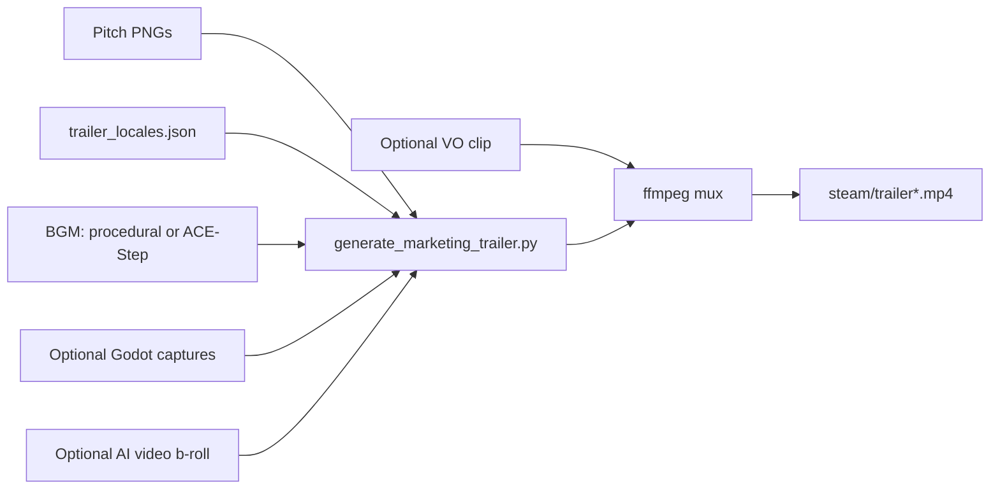

# Tides of Urashima — Marketing Trailer v2 Plan

**Version:** 1.0  
**Status:** Plan only — **do not run generation** until assets and optional tool changes are ready.  
**Scope:** Steam / social marketing trailers — **not** in-game FMV.  
**Cross-refs:** `steam/TRAILER_SCRIPT.md`, `steam/trailer_locales.json`, `tools/generate_marketing_trailer.py`, `docs/VO_HIT_LIST.md`, `game/data/audio/ace_step_prompts.json`

---

## 1. What v2 changes (vs v1)

| Area | v1 (shipped baseline) | v2 (target) |
|------|----------------------|-------------|
| **Visuals** | Ken Burns on pitch PNGs only | Same backbone; optionally swap 2–3 segments for Godot viewport captures after M6 |
| **BGM** | Procedural pentatonic score (`steam/trailer_bgm.ogg`) | ACE-Step hero montage stitched from `cine_opening_hero` + ending sting (or keep procedural fallback) |
| **VO** | Text only | **Optional** one sting on SC-03 (`sc03_yuzu_01`) — trailer stays mostly silent |
| **B-roll** | None | **Optional** 2–3 s AI video inserts between cards (Runway/Kling) — marketing only |
| **Locales** | en / ja / zh | Same three outputs |
| **Length** | ~75 s | Same beat sheet unless script edit approved |

**Policy (unchanged):** In-game movies = Godot cinematics + `CinematicDirector`. Video AI = marketing/trailer only. Codified in `.cursorrules` §0 and `docs/MCP_STACK.md`.

---

## 2. Outputs

| File | Locale | Notes |
|------|--------|-------|
| `steam/trailer.mp4` | English | Primary Steam upload |
| `steam/trailer_ja.mp4` | Japanese | Same video timing; localized on-screen text |
| `steam/trailer_zh.mp4` | Chinese | Same video timing; localized on-screen text |
| `steam/trailer_bgm.ogg` | — | Shared audio bed (procedural v1 or ACE-Step v2) |
| `steam/trailer_v2_bgm.ogg` | — | **Optional** separate cache so v1 BGM is not overwritten during experiments |

All renders: **1920×1080**, **30 fps**, H.264 + AAC.

---

## 3. Prerequisites

### 3.1 System tools

```bash
bash tools/check_dev_environment.sh   # ffmpeg, ffprobe, numpy
```

| Tool | Purpose |
|------|---------|
| `ffmpeg` / `ffprobe` | Clip render, concat, mux, BGM trim |
| `numpy` | Procedural BGM fallback in generator |
| `python3` | `generate_marketing_trailer.py`, `generate_ai_bgm.py`, `generate_ai_vo.py` |

### 3.2 Art assets (required)

All paths relative to `docs/pitch/illustrations/`:

- **20 scene PNGs** — `scenes/SC-00_prologue.png` … `SC-17c_drift.png`
- **5 character PNGs** — `characters/party_lineup.png`, portraits (used in deck; trailer uses `party_lineup` twice)

Inventory: `docs/pitch/illustrations/README.md`

**Verify before render:**

```bash
python3 - <<'PY'
import json
from pathlib import Path
root = Path("docs/pitch/illustrations")
data = json.loads(Path("steam/trailer_locales.json").read_text())
missing = [s["image"] for s in data["segments"] if s["image"] and not (root / s["image"]).exists()]
print("OK" if not missing else f"Missing: {missing}")
PY
```

### 3.3 Fonts (locale drawtext)

| Locale | Font path (Linux cloud) |
|--------|-------------------------|
| en | DejaVu Serif Bold + DejaVu Sans |
| ja / zh | WenQuanYi Micro Hei |

Install if missing: `sudo apt-get install -y fonts-dejavu fonts-wqy-microhei`

### 3.4 Optional — ACE-Step BGM (GPU)

```bash
bash tools/install_ace_step.sh
cd .cache/ace-step-1.5 && uv run acestep-api   # separate terminal; needs GPU
export ACESTEP_API_URL=http://127.0.0.1:8001
```

Without GPU: use `--fallback` (procedural placeholders) or manual Gradio export per `docs/audio_sheets/`.

### 3.5 Optional — ElevenLabs VO (one clip)

- Secret: **`ELEVENLABS_API_KEY`** in Cursor Secrets
- Voice IDs filled in `game/data/audio/vo_prompts.json` (replace `PLACEHOLDER_*`)
- Trailer candidate: **`sc03_yuzu_01`** only (`docs/VO_HIT_LIST.md` P0)

---

## 4. Pipeline overview



**v1 today:** `A + B + C(procedural) → D → O` — no VO, no captures.

**v2 target:** `A + B + C(ACE-Step) → D` → optional `E` via ffmpeg → `O`.

---

## 5. Beat sheet (unchanged unless script edit)

Full table: `steam/TRAILER_SCRIPT.md` (23 segments, ~75 s).

| Segment | Image | Duration | v2 notes |
|---------|-------|----------|----------|
| Title | — | 2.5 s | Solid color card |
| Party | `party_lineup.png` | 4.0 s | |
| SC-00 … SC-17c | scene PNGs | 2.0–4.0 s each | SC-03: optional VO sting |
| CTA | `party_lineup.png` | 4.5 s | Store tagline |

Localized strings: edit **`steam/trailer_locales.json`** only (not hardcoded in Python).

---

## 6. Step-by-step — regenerate v1 baseline (no v2 upgrades)

Use this to confirm the toolchain before layering v2 assets.

```bash
# English only
python3 tools/generate_marketing_trailer.py

# All locales + shared BGM
python3 tools/generate_marketing_trailer.py --all-locales

# Force new procedural BGM
python3 tools/generate_marketing_trailer.py --all-locales --regen-bgm
```

**What the script does:**

1. Loads segments from `steam/trailer_locales.json`
2. Ken Burns each PNG (or title card) → temp MP4 clips
3. Concatenates silent video
4. Ensures `steam/trailer_bgm.ogg` (generates if missing)
5. Muxes BGM + video → `steam/trailer.mp4` (and `_ja`, `_zh`)

---

## 7. Step-by-step — v2 BGM (ACE-Step hero score)

### 7.1 Generate source tracks

Minimum for a cohesive ~75 s bed:

| Track ID | Scene use in trailer | Duration (source) |
|----------|----------------------|-------------------|
| `cine_opening_hero` | Segments 1–15 (~55 s feel) | 105 s (trim) |
| `cine_ending_rewind_hero` **or** `sting_choice_silence` | Final third / CTA lift | 4–30 s (trim) |

```bash
python3 tools/generate_ai_bgm.py --track cine_opening_hero --api
python3 tools/generate_ai_bgm.py --track cine_ending_rewind_hero --api
# Or batch:
python3 tools/generate_ai_bgm.py --category opening --category ending --api
```

Outputs land in `game/assets/audio/bgm/` per `ace_step_prompts.json`.

### 7.2 Stitch + trim to trailer length

Measure target duration from locale file:

```bash
python3 - <<'PY'
import json
d = json.load(open("steam/trailer_locales.json"))
print(f"{sum(s['duration'] for s in d['segments']):.1f}s")
PY
```

Manual stitch (~75 s) with ffmpeg (adjust fade points after listening):

```bash
DUR=75   # match sum above

ffmpeg -y \
  -i game/assets/audio/bgm/cine_opening_hero.ogg \
  -i game/assets/audio/bgm/cine_ending_rewind_hero.ogg \
  -filter_complex "\
    [0:a]afade=t=out:st=58:d=4,volume=0.9[a0];\
    [1:a]afade=t=in:st=0:d=2,volume=0.85[a1];\
    [a0][a1]acrossfade=d=3:c1=tri:c2=tri[aout]" \
  -map "[aout]" -t "$DUR" -c:a libvorbis -q:a 6 steam/trailer_v2_bgm.ogg
```

**Normalize** (optional, target ~-16 LUFS per `docs/AUDIO_PRODUCTION_GUIDE.md`):

```bash
ffmpeg -i steam/trailer_v2_bgm.ogg -af loudnorm=I=-16:TP=-1.5:LRA=11 steam/trailer_v2_bgm_norm.ogg
mv steam/trailer_v2_bgm_norm.ogg steam/trailer_v2_bgm.ogg
```

### 7.3 Use custom BGM in trailer render

**Today (v1 generator):** Copy/rename to `steam/trailer_bgm.ogg` before running the script, or symlink:

```bash
cp steam/trailer_v2_bgm.ogg steam/trailer_bgm.ogg
python3 tools/generate_marketing_trailer.py --all-locales
```

**Planned tool flag (not implemented yet):**

```bash
# Future — see §10
python3 tools/generate_marketing_trailer.py --all-locales --bgm steam/trailer_v2_bgm.ogg
```

---

## 8. Step-by-step — optional VO sting (SC-03)

Trailer policy: **one line max** so text cards remain primary. Best match: Yuzu at cracked torii.

### 8.1 Generate clip

```bash
bash tools/generate_ai_vo.sh --clip sc03_yuzu_01 --locale en
# ja/zh only if you want localized VO in localized trailers (unusual for Steam — usually EN VO + localized text)
```

Files: `game/assets/audio/voice/en/sc03_yuzu_01.ogg`

### 8.2 Place on timeline

SC-03 starts after:

| Prior segments | Cumulative start |
|----------------|------------------|
| Title + party + SC-00 + SC-01 + SC-02 | **16.5 s** |

Mux VO over finished trailer (v1 — manual):

```bash
ffmpeg -y -i steam/trailer.mp4 -i game/assets/audio/voice/en/sc03_yuzu_01.ogg \
  -filter_complex "[1:a]adelay=16500|16500,volume=0.9[vo];[0:a][vo]amix=inputs=2:duration=first:dropout_transition=0[aout]" \
  -map 0:v -map "[aout]" -c:v copy -c:a aac -b:a 192k steam/trailer_with_vo.mp4
```

Repeat per locale if using localized VO. Update `steam/TRAILER_SCRIPT.md` § Audio if VO is approved for ship.

**Planned tool flag:** `--vo-segment 5 --vo-clip sc03_yuzu_01` (segment index 0-based = SC-03 card).

---

## 9. Step-by-step — optional Godot viewport captures (post-M6)

Replace illustration stills with short gameplay/cinematic captures for **2–3** high-impact beats only.

| Priority | Scene | Suggested capture | Replaces segment |
|----------|-------|-------------------|------------------|
| P0 | `ruined_village` hub | 3 s orbit pan, fog + lanterns | SC-02 (`SC-02_ruined_village.png`) |
| P0 | `palace_gate_main` | SC-12 gate reveal camera | SC-12 (`SC-12_palace_gate.png`) |
| P1 | Combat tutorial | Turn order + intent UI | SC-05 (`SC-05_salt_crab.png`) |

### 9.1 Capture workflow (GDAI or editor)

1. Open Godot at `game/project.godot`; zone lit per `docs/RENDERING_GUIDE.md`
2. Run scene; hide debug UI
3. Record 1920×1080 @ 30 fps (Godot Movie Maker or OBS)
4. Export to `steam/captures/SC-02_ruined_village.mp4` (h264)

### 9.2 Wire into trailer data

**Option A — extend `trailer_locales.json` (recommended):**

```json
{
  "image": "scenes/SC-02_ruined_village.png",
  "video": "steam/captures/SC-02_ruined_village.mp4",
  "duration": 3.0,
  "zoom": "pan_left",
  "text": { "...": "..." }
}
```

**Option B — replace PNG** (quick test; loses still fallback).

Generator must prefer `video` when present — **§10**.

---

## 10. Step-by-step — optional AI video b-roll (marketing only)

Short generative clips (2–3 s) between story cards — e.g. waves, palace void, box glow.

| Tool | Use | Log in |
|------|-----|--------|
| Runway Gen-3 / Kling | 2–3 s inserts | `docs/LICENSES.md` + `asset_manifest.license.json` |

Workflow:

1. Prompt from `docs/STORYBOARD_ILLUSTRATIONS.md` scene row (muted palette, no sunny anime)
2. Export 1920×1080 MP4
3. Drop in `steam/broll/`
4. Insert via extended locale schema (`"broll": "steam/broll/waves_01.mp4"`) or manual ffmpeg concat between segment clips

**Not** for in-game use. Run `bash tools/check_asset_compliance.sh` after adding assets.

---

## 11. Generator changes (implement before “one command” v2)

Current `tools/generate_marketing_trailer.py` supports v1 only. For full v2 automation, add:

| Flag / behavior | Purpose |
|-----------------|--------|
| `--bgm PATH` | External OGG/WAV instead of `ensure_bgm()` procedural |
| `--skip-bgm` | Video-only render for manual audio pass |
| `--vo-clip ID --vo-segment N [--vo-offset SEC]` | Mux ElevenLabs OGG at segment start |
| Segment `video` key in JSON | Use MP4 clip instead of Ken Burns on PNG |
| `--captures-dir` | Resolve `steam/captures/*.mp4` |
| `--output-suffix _v2` | Write `trailer_v2.mp4` without clobbering v1 |

Keep procedural BGM as default when `--bgm` omitted (CI / cloud without GPU).

---

## 12. QA checklist (before Steam upload)

### Video

- [ ] 1920×1080, 30 fps, no letterbox errors
- [ ] Total duration 72–78 s (Steam tolerates ~90 s; script targets ~75 s)
- [ ] No clipped drawtext (check ja/zh long lines on SC-13, SC-16)
- [ ] Fade in/out on each card; no flash frames at concat joins
- [ ] File size reasonable (&lt; 500 MB per locale)

### Audio

- [ ] BGM does not clip; dialogue sting (if any) sits ~3–6 dB below bed
- [ ] No vocals in BGM bed (ACE-Step negative prompt enforced)
- [ ] Ending does not cut mid-phrase

### Localization

- [ ] Three files: `trailer.mp4`, `trailer_ja.mp4`, `trailer_zh.mp4`
- [ ] Same timing across locales; only on-screen text differs
- [ ] CTA line readable in all three scripts

### Compliance

- [ ] Pitch art + any AI b-roll logged in `docs/LICENSES.md`
- [ ] `bash tools/check_asset_compliance.sh` passes
- [ ] ElevenLabs terms OK for commercial Steam trailer if VO used

### Steam page

- [ ] Upload primary `trailer.mp4` to Steamworks → Trailer
- [ ] Optional: locale-specific trailers in store localizations
- [ ] Capsules/screenshots still from pitch or 3D — see `steam/STORE_PAGE.md`

---

## 13. Recommended generation order (when you are ready)

1. **Validate assets** — §3.2 verify script  
2. **Baseline render** — §6 v1 command; confirm ffmpeg/fonts  
3. **ACE-Step pass** — §7 on GPU machine; stitch `trailer_v2_bgm.ogg`  
4. **Re-render video** — copy BGM → `trailer_bgm.ogg` or future `--bgm`  
5. **Optional VO** — §8 single sting; manual mux  
6. **Optional captures** — §9 after M6 vertical slice  
7. **Optional b-roll** — §10 last; highest license review overhead  
8. **QA** — §12  
9. **Commit** — trailer MP4s + `trailer_bgm.ogg` + locale/script edits; update `docs/LICENSES.md`

---

## 14. Quick reference

| Task | Command |
|------|---------|
| List VO clips | `bash tools/generate_ai_vo.sh --list` |
| List BGM tracks | `python3 tools/generate_ai_bgm.py --list` |
| Render all locales (v1) | `python3 tools/generate_marketing_trailer.py --all-locales` |
| Script / beats | `steam/TRAILER_SCRIPT.md` |
| Segment text / timing | `steam/trailer_locales.json` |
| VO policy | `docs/VO_HIT_LIST.md` |
| Cinematic beats (in-game) | `docs/CINEMATICS.md` |

**This document is the v2 plan only.** Run §6–§13 when assets and approvals are ready — not as part of doc authoring.
