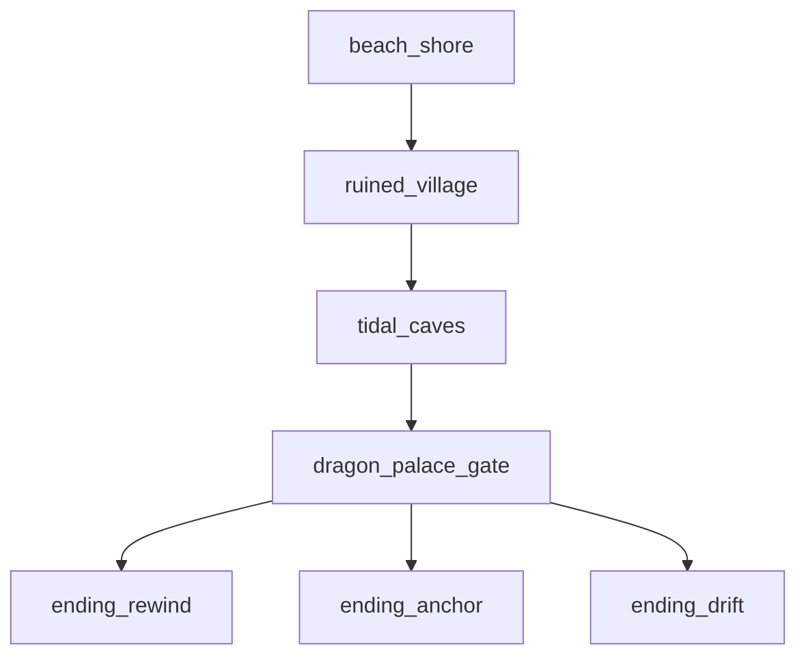

# Tides of Urashima — World Map & Zone Flow

**Version:** 1.0 (Pre-build)  
**Story reference:** `docs/STORYBOARD.md`, `game/data/story/scenes.json`  
**Cross-refs:** `docs/LEVEL_DESIGN.md` (per-zone interactables & triggers), `docs/ENVIRONMENT_KITS.md`, `docs/QUEST_AND_FLAGS.md`, `docs/SAVE_AND_FAIL_STATES.md`

> **Level designers / GDAI:** Use [`LEVEL_DESIGN.md`](LEVEL_DESIGN.md) for node names, encounter triggers, and blockout tables. This doc is the **zone graph summary**.

## 1. World overview

Single continuous coastal region — no world map screen v1. Player walks between zones via authored transitions.

```
                    [dragon_palace_gate]
                            ↑
                     wraith_pearl gate
                            ↑
    [beach_shore] ←→ [ruined_village] → [tidal_caves]
         SC-01          hub SC-02–05        SC-06–11
```

---

## 2. Zone reference

| Zone ID | Display name | Act | Scenes | Default BGM |
|---------|--------------|-----|--------|-------------|
| `beach_shore` | Shore of Return | I | SC-01 | `bgm_village` |
| `ruined_village` | Ruined Fishing Village | I | SC-02–05 | `bgm_village` |
| `tidal_caves` | Tidal Caves | II | SC-06–11 | `bgm_caves` |
| `dragon_palace_gate` | Dragon Palace Gate | II–III | SC-12–16 | `bgm_palace` |
| `ending_rewind` | Restored Village | End | SC-17a | `bgm_ending_rewind` |
| `ending_anchor` | Dawn Shore | End | SC-17b | `bgm_ending_anchor` |
| `ending_drift` | Open Sea | End | SC-17c | `bgm_ending_drift` |

---

## 3. Connection table

| From | To | Trigger | Requirement |
|------|-----|---------|-------------|
| `beach_shore` | `ruined_village` | Walk to gate | SC-01 complete |
| `ruined_village` | `tidal_caves` | Cave entrance below cliffs | `cave_entrance_unlocked` (SC-04) |
| `tidal_caves` | `dragon_palace_gate` | Palace gate at cave exit | `wraith_pearl` (key item) + `yuzu_joined` |
| `dragon_palace_gate` | Ending zones | SC-16 choice | `ending_chosen` |

**Backtracking:** Allowed. Village hub revisitable until ending. No fast travel v1.

---

## 4. Ruined village layout (hub)

```
        [Torii / SC-03]
              |
    [Well save] — [Shack / Roku SC-04]
              |
    [Festival ground — banner inspect]
              |
    [Pier] — [Path to SC-05 crab]
              |
         [Cave entrance ↓]
```

| Landmark | Scene / function |
|----------|------------------|
| Well | Manual save + full heal first use |
| Shack | Shop, Roku, `cave_map` |
| Torii | Yuzu spirit SC-03 |
| Cave mouth | Zone load to `tidal_caves` |

**Quest pointer:** Soft arrow to torii after 2 inspects (`GAME_FEEL.md`).

---

## 5. Tidal caves layout (linear with branch)

```
[Entrance SC-06]
      ↓
[Flooded chamber SC-07 puzzle]
      ↓
[Deep pool SC-08]
      ↓
[Boss arena SC-09]
      ↓
[Shrine alcove SC-10]
      ↓
[Flashback wall SC-11]
      ↓
[Exit → Palace gate SC-12]
```

**Blockers:** SC-08 gated by `water_puzzle_solved`. SC-12 gated by `wraith_pearl`.

---

## 6. Dragon Palace Gate layout

```
[Exterior gate SC-12] — save point
      ↓
[Mirror chamber SC-13]
      ↓
[Sentinel hall SC-14]
      ↓
[Throne arena SC-15 → SC-16 choice]
```

No reverse-gravity rooms v1 (`STORYBOARD.md` SC-12).

---

## 7. Save points

| Location | Zone | Scene |
|----------|------|-------|
| Village well | `ruined_village` | SC-02+ |
| Palace gate exterior | `dragon_palace_gate` | SC-12+ |

**Autosave:** Before each boss (SC-09, SC-14, SC-15) and on scene transitions (`SAVE_AND_FAIL_STATES.md`).

---

## 8. Player navigation aids

| Aid | v1 |
|-----|-----|
| Zone name toast | On enter (2 s fade) |
| Quest tracker | Active objective text |
| Compass | **No** |
| Minimap | **No** |
| Objective marker | Soft quest arrow only (village) |

**Design:** Short game — player should never be lost &gt;2 min. Hints at SC-07 if stuck (`PUZZLE_DESIGN.md`).

---

## 9. Scene flow (canonical)



Full scene IDs: `STORYBOARD.md` diagram.

---

## 10. QA checklist

- [ ] Cannot enter caves before SC-04
- [ ] Cannot reach SC-08 before puzzle solved
- [ ] Cannot open palace without pearl
- [ ] Backtrack to village after Yuzu join works
- [ ] Zone name displays on each transition
- [ ] Save at well persists across quit
