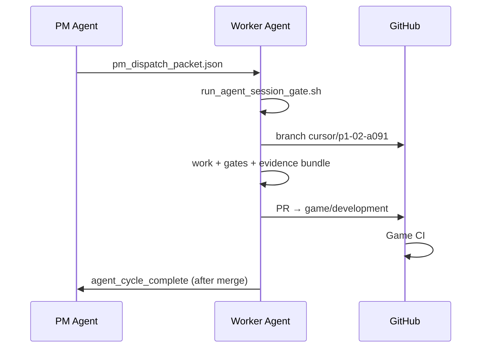

# Multi-Agent Branch Strategy

**Version:** 1.0  
**Authority:** One issue → one feature branch → one PR → merge → cycle event.  
**Cross-refs:** `docs/workflow/DEVELOPMENT_LIFECYCLE.md`, `docs/workflow/BRANCHING.md`, `docs/workflow/BRANCHING_DECISION_RECORD.md`, `docs/agents/SPRINT_ORCHESTRATION.md`, `artifacts/pm_dispatch_packet.json`

---

## 1. Branch naming

| Scope | Pattern | Example |
|-------|---------|---------|
| Cloud agent feature work | `cursor/<issue-id-lowercase>-a091` | `cursor/p1-01-a091` |
| Sprint integration branch | `game/development` | long-lived implementation trunk |
| Design / orchestration | `main` | docs, `game/data/`, tools |

Issue field: `branch_name_pattern` in `sprint_board.json` (default `cursor/{issue_id}-a091`).

**Cursor Cloud agents:** session instructions may use suffix `-ec08` instead of `-a091` — same issue ID, same PR target (`game/development`). Factory dispatch uses the board pattern; cloud agents follow their session suffix when creating branches.

---

## 2. Per-issue workflow



---

## 3. Definition of done

| `done_requires` | When to use |
|-----------------|-------------|
| `pr_merged` | Default — gameplay, scenes, shaders |
| `ci_green_on_branch` | Bootstrap (P1-00), docs-only on trunk |
| `push_only` | PM review / meta tasks (P1-06) |

Enforced by `python3 tools/pm_check_done_criteria.py <issue_id>` before `pm_update_issue.py --status done`.

---

## 4. Strict role policy

One agent role per session. `run_agent_session_gate.sh` rejects when:

- Agent not in `next_dispatch`
- Agent ≠ `agent_owner` and ≠ `co_agent` (`AGENT_SESSION_STRICT_ROLE=1` default)

Do **not** combine Architect + Builder in one session.

---

## 5. Parallel issues

When `parallel_with` is set and WIP caps allow, orchestrator may dispatch two starts (e.g. P1-02 Builder + P1-03 Architect). Each still gets its own branch and PR.

---

## 6. Evidence

Before marking done:

```bash
python3 tools/pm_bundle_evidence.py P1-02 --gate L2_scene_primitives --artifact artifacts/qa_reports/...
python3 tools/pm_check_done_criteria.py P1-02 --commit <sha>
python3 tools/pm_update_issue.py P1-02 --status done --commit <sha>
bash tools/pm_emit_cycle_event.sh agent_cycle_complete --issue P1-02 --agent builder --commit <sha>
```

---

## 7. Failure path

```bash
bash tools/pm_emit_cycle_event.sh agent_cycle_failed --issue P1-02 --agent builder --note "L2_scene_primitives FAIL"
```

PM re-dispatches **same issue** for remediation — does not skip to next issue.

---

## 8. Cross-refs

- `docs/agents/CLOUD_AGENT_SETUP_RUNBOOK.md`
- `docs/agents/FACTORY_WATCHDOG.md`
- `game/data/qa/sprint_board.json`
