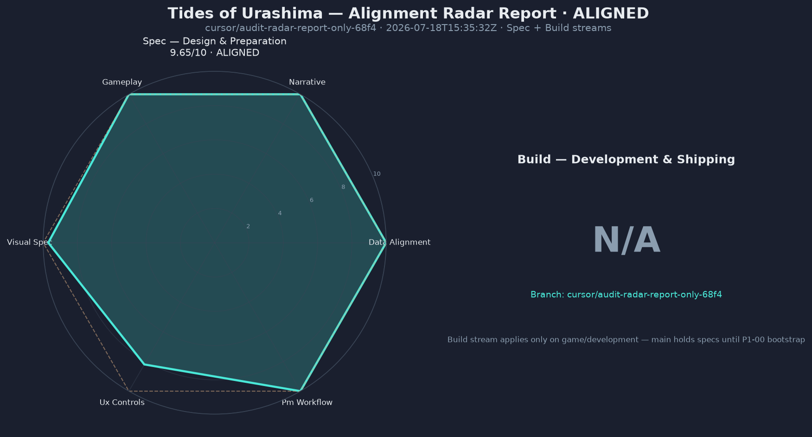
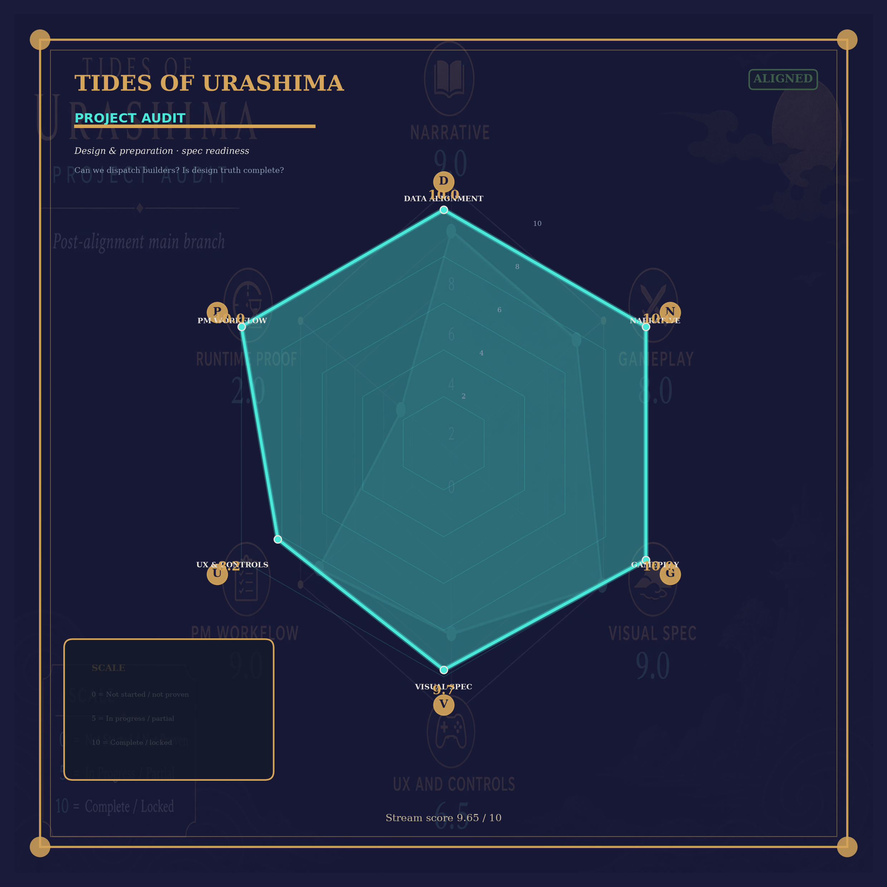
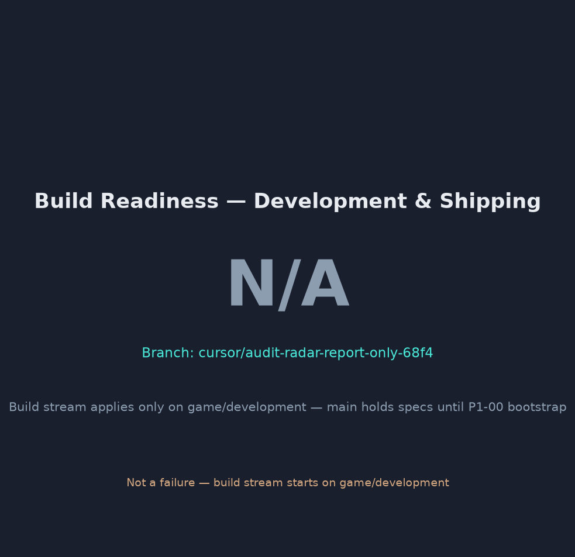

# Tides of Urashima — Alignment Audit Report

**Alignment audit — ALIGNED (cursor/audit-radar-report-only-68f4 @ febffb9) · Spec 9.65/10 · Build N/A/10**
Generated: 2026-07-18T15:35:32Z · Audit ID: `20260718T153532Z_post_merge`
Branch: `cursor/audit-radar-report-only-68f4` · Commit: `febffb9`

## Verdict: **ALIGNED**

## Streams (management view)

| Stream | Score | Status | Question |
|--------|-------|--------|----------|
| Design & Preparation | 9.65/10 | Aligned | Can we dispatch builders? Is design truth complete? |
| Development & Shipping | N/A | N/A — Build stream applies only on game/development — main holds specs until P1-00 bootstrap | Does the game run, pass gates, and approach Steam? |

> **Do not merge spec + build into one radar for management.** Each stream answers a different question.

### Design & Preparation domains

| Domain | Score |
|--------|-------|
| Data Alignment | 10.0 |
| Narrative | 10.0 |
| Gameplay | 10.0 |
| Pm Workflow | 10.0 |
| Visual Spec | 9.7 |
| Ux Controls | 8.2 |

## All domain scores (0–10)

| Domain | Score |
|--------|-------|
| Data Alignment | 10.0 |
| Narrative | 10.0 |
| Gameplay | 10.0 |
| Pm Workflow | 10.0 |
| Visual Spec | 9.7 |
| Ux Controls | 8.2 |
| Steam Ship | 8.05 |
| Runtime Proof | 3.5 |

## CI summary
- Script: `run_docs_ci_checks.sh`
- PASS: **36** · FAIL: **0** · SKIP: 5

## Data parity
- Encounters: OK
- Hooks: OK
- Tutorial flags: OK
- Sprint board ↔ pack: OK

## Recommendation checklist

### Stakeholder comms (P2) (1 open)
- [ ] **P2** Refresh stakeholder visual pack — Copy PNGs to docs/compliance/alignment_audit_visuals/ then: bash tools/run_alignment_audit.sh --visuals-from docs/compliance/alignment_audit_visuals

## Stream radars

Auto-generated from live audit scores. Spec on `main`; build on `game/development`.

*Two-stream radar report (auto-generated)*

*Spec readiness radar (auto-generated)*

*Build readiness radar (auto-generated)*

---
Authority: `docs/qa/ALIGNMENT_AUDIT.md` · Re-run: `bash tools/run_alignment_audit.sh`
