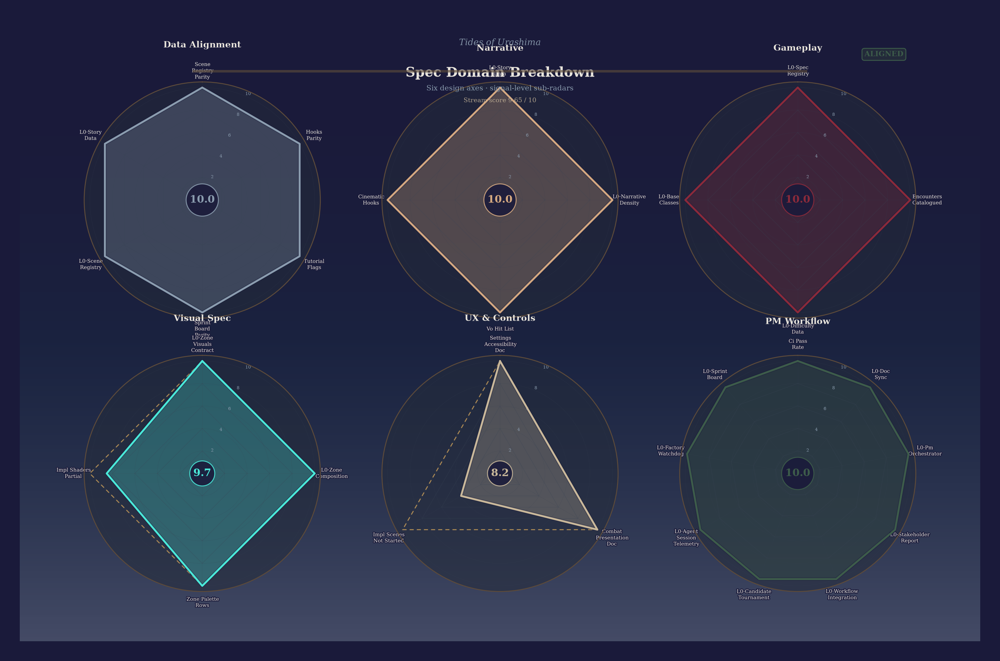
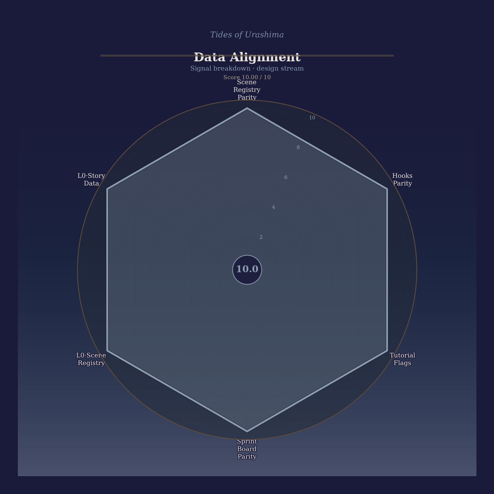
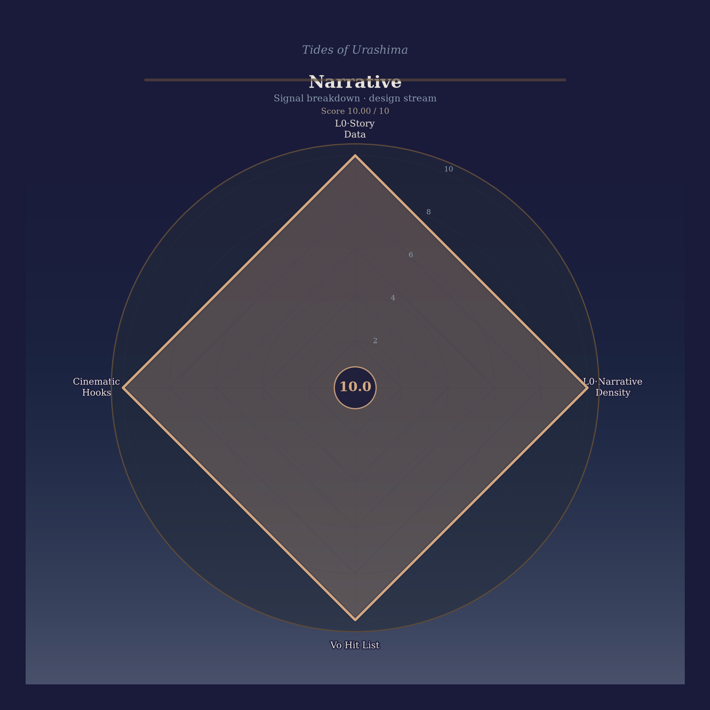
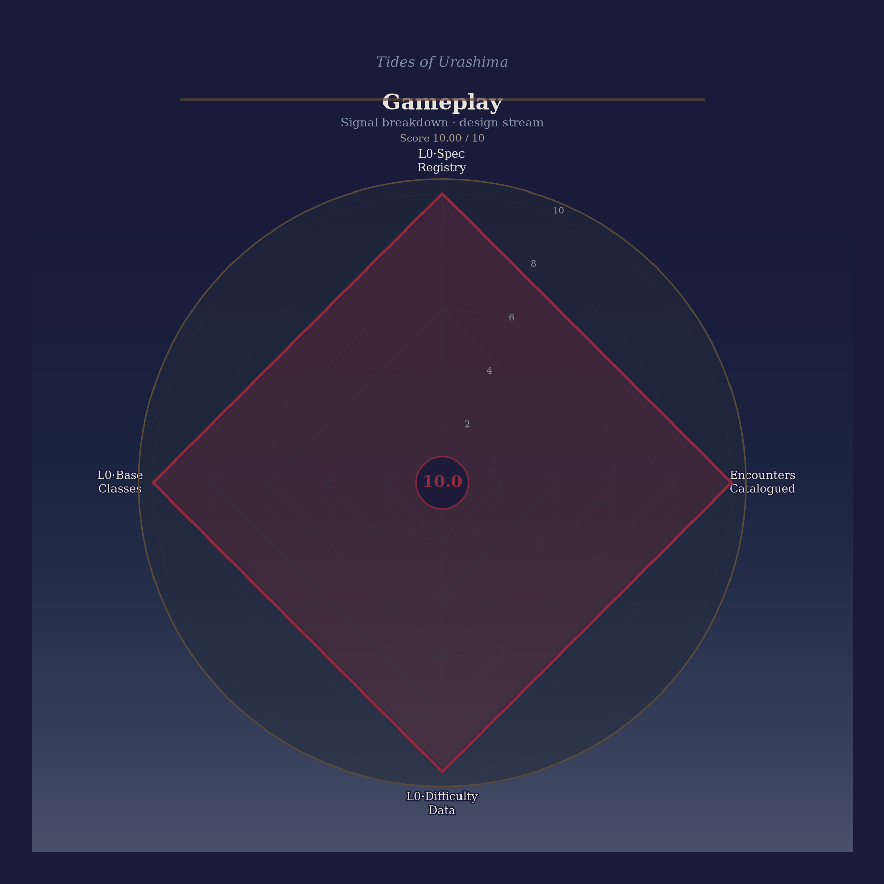
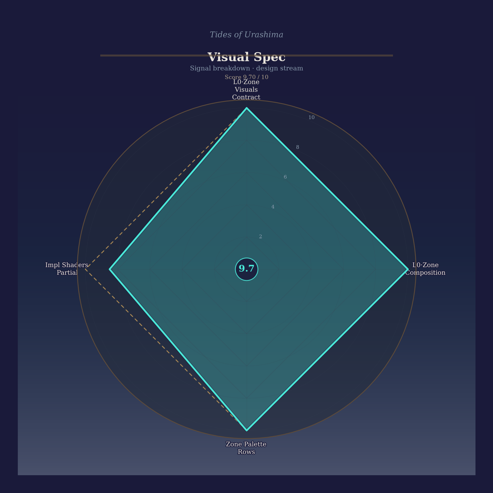
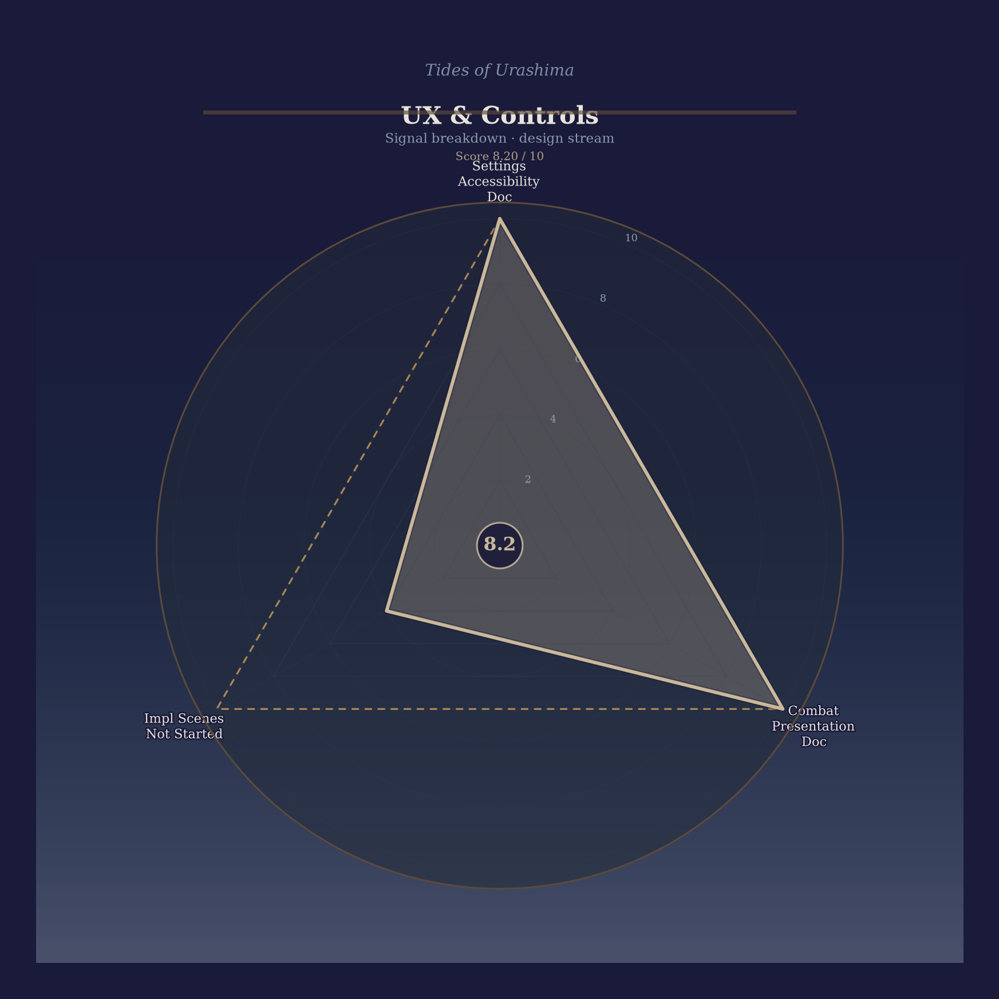
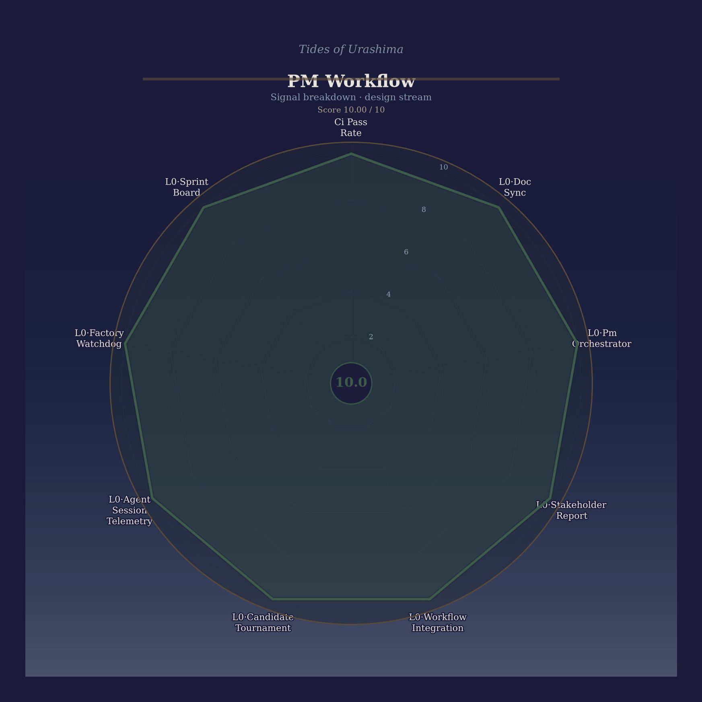

# Tides of Urashima — Alignment Audit Report

**Alignment audit — ALIGNED (cursor/audit-radar-theme-68f4 @ 1e333ee) · Spec 9.65/10 · Build N/A/10**
Generated: 2026-07-18T15:43:22Z · Audit ID: `20260718T154322Z_post_merge`
Branch: `cursor/audit-radar-theme-68f4` · Commit: `1e333ee`

## Verdict: **ALIGNED**

## Streams (management view)

| Stream | Score | Status | Question |
|--------|-------|--------|----------|
| Design & Preparation | 9.65/10 | Aligned | Can we dispatch builders? Is design truth complete? |
| Development & Shipping | N/A | N/A — Build stream applies only on game/development — main holds specs until P1-00 bootstrap | Does the game run, pass gates, and approach Steam? |

> **Do not merge spec + build into one radar for management.** Each stream answers a different question.

### Design & Preparation domains

| Domain | Score |
|--------|-------|
| Data Alignment | 10.0 |
| Narrative | 10.0 |
| Gameplay | 10.0 |
| Pm Workflow | 10.0 |
| Visual Spec | 9.7 |
| Ux Controls | 8.2 |

## Spec domain signal breakdown

Each of the 6 spec domains has its own sub-radar (signals behind the axis score).

### Data Alignment (10.0/10)

| Signal | Score |
|--------|-------|
| `scene_registry_parity` | 10.0 |
| `hooks_parity` | 10.0 |
| `tutorial_flags` | 10.0 |
| `sprint_board_parity` | 10.0 |
| `L0_scene_registry` | 10.0 |
| `L0_story_data` | 10.0 |

### Narrative (10.0/10)

| Signal | Score |
|--------|-------|
| `L0_story_data` | 10.0 |
| `L0_narrative_density` | 10.0 |
| `vo_hit_list` | 10.0 |
| `cinematic_hooks` | 10.0 |

### Gameplay (10.0/10)

| Signal | Score |
|--------|-------|
| `L0_spec_registry` | 10.0 |
| `encounters_catalogued` | 10.0 |
| `L0_difficulty_data` | 10.0 |
| `L0_base_classes` | 10.0 |

### Visual Spec (9.7/10)

| Signal | Score |
|--------|-------|
| `L0_zone_visuals_contract` | 10.0 |
| `L0_zone_composition` | 10.0 |
| `zone_palette_rows` | 10.0 |
| `impl_shaders_partial` | 8.5 |

### Ux Controls (8.2/10)

| Signal | Score |
|--------|-------|
| `settings_accessibility_doc` | 10.0 |
| `combat_presentation_doc` | 10.0 |
| `impl_scenes_not_started` | 4.0 |

### Pm Workflow (10.0/10)

| Signal | Score |
|--------|-------|
| `ci_pass_rate` | 10.0 |
| `L0_doc_sync` | 10.0 |
| `L0_pm_orchestrator` | 10.0 |
| `L0_stakeholder_report` | 10.0 |
| `L0_workflow_integration` | 10.0 |
| `L0_candidate_tournament` | 10.0 |
| `L0_agent_session_telemetry` | 10.0 |
| `L0_factory_watchdog` | 10.0 |
| `L0_sprint_board` | 10.0 |

## All domain scores (0–10)

| Domain | Score |
|--------|-------|
| Data Alignment | 10.0 |
| Narrative | 10.0 |
| Gameplay | 10.0 |
| Pm Workflow | 10.0 |
| Visual Spec | 9.7 |
| Ux Controls | 8.2 |
| Steam Ship | 8.05 |
| Runtime Proof | 3.5 |

## CI summary
- Script: `run_docs_ci_checks.sh`
- PASS: **36** · FAIL: **0** · SKIP: 5

## Data parity
- Encounters: OK
- Hooks: OK
- Tutorial flags: OK
- Sprint board ↔ pack: OK

## Recommendation checklist

### Stakeholder comms (P2) (1 open)
- [ ] **P2** Refresh stakeholder visual pack — Copy PNGs to docs/compliance/alignment_audit_visuals/ then: bash tools/run_alignment_audit.sh --visuals-from docs/compliance/alignment_audit_visuals

## Stream radars (overview)

*Two-stream radar report (auto-generated)*

*Spec readiness radar (auto-generated)*

*Build readiness radar (auto-generated)*

## Spec sub-radar breakdown (6 domains)

Each panel shows signal-level scores within one spec domain.

*Spec sub-radar breakdown (6 domains) (auto-generated)*

## Spec domain sub-radars (detail)

*Data Alignment sub-radar (auto-generated)*

*Narrative sub-radar (auto-generated)*

*Gameplay sub-radar (auto-generated)*

*Visual Spec sub-radar (auto-generated)*

*UX & Controls sub-radar (auto-generated)*

*PM Workflow sub-radar (auto-generated)*

---
Authority: `docs/qa/ALIGNMENT_AUDIT.md` · Re-run: `bash tools/run_alignment_audit.sh`
