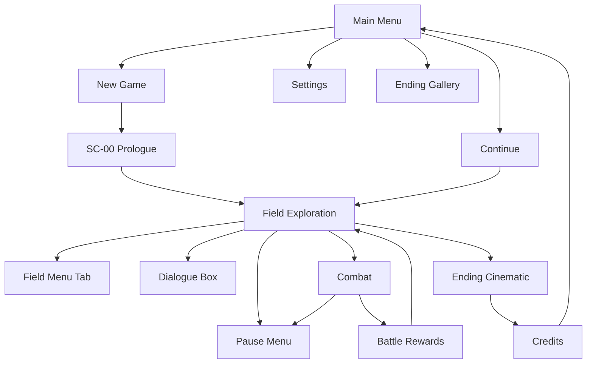

# UI/UX Flow — Screen map, main menu, HUD, field menu

**Hub:** [`UI_UX_FLOW.md`](../UI_UX_FLOW.md)

## When to read

Use **UI/UX Flow — Screen map, main menu, HUD, field menu** (roles: builder, visual) when you need this reference during the current task Jump to a section below instead of reading end-to-end (4 sections).

## Jump to

- [1. Screen map](#1-screen-map)
- [2. Main menu](#2-main-menu)
- [3. HUD — field](#3-hud-field)
- [4. Field menu (Tab)](#4-field-menu-tab)

## 1. Screen map

---

## 2. Main menu

| Option | Condition | Action |
|--------|-----------|--------|
| New Game | always | SC-00 → beach_shore |
| Continue | save exists | Last save slot |
| Ending Gallery | `game_completed` once | View unlocked endings |
| Settings | always | Settings overlay |
| Quit | always | Desktop exit |

**Title art:** Muted coastal; box motif; `Noto Serif JP` title

---

## 3. HUD — field

| Element | Position | Notes |
|---------|----------|-------|
| Interaction prompt | Center-bottom | "E — Investigate" localized |
| Quest tracker | Top-right | Active stage title only |
| Party HP (optional) | Top-left | Small bars post-Yuzu join |
| Area name | Top-center fade | On zone enter, 2s |

**No minimap v1.** `cave_map` key item adds journal text only.

---

## 4. Field menu (Tab)

| Tab | Contents |
|-----|----------|
| **Items** | Consumables; Use / Sell |
| **Equipment** | 3 slots × active party; compare stats |
| **Party** | 3 members; stats; skills list (read-only) |
| **Quests** | Active + completed main quests |
| **Lore** | 8 entries; unread dot |
| **Shop** | Only near Roku shack |

**Pause:** Esc opens overlay — Resume, Settings, Save, Return to Title.
**Pause → Save** writes the autosave slot; available anywhere in the field **except mid-combat and
during SC-16** — it does not replace SavePoints (well/palace gate remain the "ritual" manual saves
with their own toast; `SAVE_AND_FAIL_STATES.md` §1).

---
