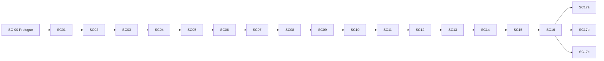

# Storyboard — Flow diagram + production priority

**Hub:** [`STORYBOARD.md`](../STORYBOARD.md)

## Scene flow diagram

---

## Production priority (pre-build → art rebuild)

### Phase 0 — Design lock (complete)
- [x] GDD, storyboard, art bible
- [x] Character bible, environment kits, boss designs, encounter table, cinematics
- [x] Quest/flags, tutorial, ending, economy, combat, skills, UI, save, puzzle, achievements, playtest

### Phase 1 — Vertical art slice
1. SC-02 Ruined Village hub (`village_torii_damaged`, shack, well, Urashima model)
2. SC-05 tutorial combat (Salt Crab model + portraits)

### Phase 2 — Act II art
3. SC-06–09 Tidal Caves + Shore Wraith boss
4. SC-10 Yuzu model + join VFX

### Phase 3 — Act III art
5. SC-12–16 Palace gate, mirror, Sentinel, Tide Keeper, choice UI
6. SC-17a/b/c ending environments

### Legacy greybox order (prototype branches only)
1. SC-01, SC-02, SC-05 (movement + first fight)
2. SC-06, SC-09 (dungeon + boss template)
3. SC-15, SC-16 (final boss + choice UI)
4. Remaining scenes as content pass
