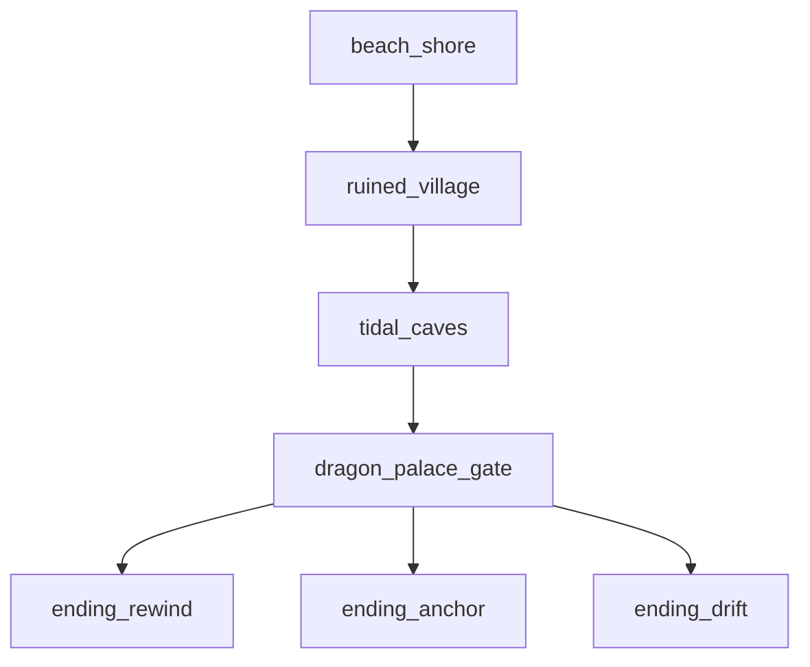

# World Map & Flow — Save, nav, scene flow, QA

**Hub:** [`WORLD_MAP_AND_FLOW.md`](../WORLD_MAP_AND_FLOW.md)

## When to read

Use **World Map & Flow — Save, nav, scene flow, QA** (roles: architect, builder, narrative) when you need this reference during the current task Jump to a section below instead of reading end-to-end (4 sections).

## Jump to

- [7. Save points](#7-save-points)
- [8. Player navigation aids](#8-player-navigation-aids)
- [9. Scene flow (canonical)](#9-scene-flow-canonical)
- [10. QA checklist](#10-qa-checklist)

## 7. Save points

| Location | Zone | Scene |
|----------|------|-------|
| Village well | `ruined_village` | SC-02+ |
| Palace gate exterior | `dragon_palace_gate` | SC-12+ |

**Autosave:** Before each boss (SC-09, SC-14, SC-15) and on scene transitions (`SAVE_AND_FAIL_STATES.md`).

---

## 8. Player navigation aids

| Aid | v1 |
|-----|-----|
| Zone name toast | On enter (2 s fade) |
| Quest tracker | Active objective text |
| Compass | **No** |
| Minimap | **No** |
| Objective marker | Soft quest arrow only (village) |

**Design:** Short game — player should never be lost &gt;2 min. Hints at SC-07 if stuck (`PUZZLE_DESIGN.md`).

---

## 9. Scene flow (canonical)

Full scene IDs: `STORYBOARD.md` diagram.

---

## 10. QA checklist

- [ ] Cannot enter caves before SC-04
- [ ] Cannot reach SC-08 before puzzle solved
- [ ] Cannot open palace without pearl
- [ ] Backtrack to village after Yuzu join works
- [ ] Zone name displays on each transition
- [ ] Save at well persists across quit
