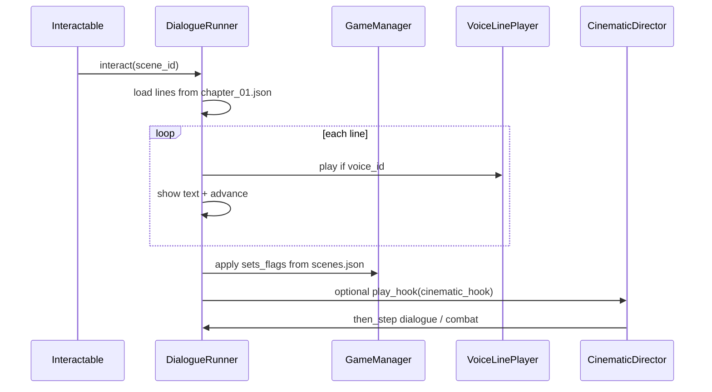
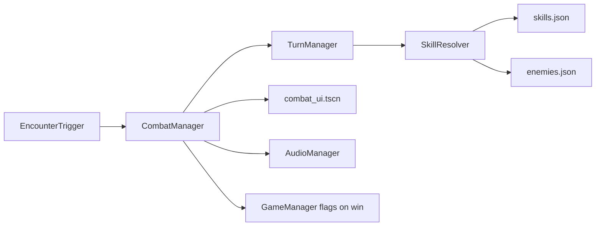

# Technical Design — Narrative + combat stacks

**Hub:** [`TECHNICAL_DESIGN.md`](../TECHNICAL_DESIGN.md)

## When to read

Use **Technical Design — Narrative + combat stacks** (roles: architect, builder) when you need this reference during the current task Jump to a section below instead of reading end-to-end (2 sections).

## Jump to

- [6. Narrative stack](#6-narrative-stack)
- [7. Combat stack](#7-combat-stack)


## 6. Narrative stack



| Component | File | Notes |
|-----------|------|-------|
| `DialogueRunner` | `scripts/narrative/dialogue_runner.gd` | Filters lines by `requires_flags` via `StoryData.filter_dialogue_lines` |
| `VoiceLinePlayer` | `scripts/story/voice_line_player.gd` ✅ | Resolves `res://assets/audio/voice/{locale}/{voice_id}.ogg`; `zh-Hant` uses `{vo_dialect}` subfolder (`cant` / `cmn`) |
| `CinematicDirector` | `scripts/story/cinematic_director.gd` ✅ | Reads `cinematic_hooks.json`; emits `then_step_requested` |
| `QuestTracker` | `scripts/narrative/quest_tracker.gd` | HUD + stage evaluation from `main_quests.json` |

---


## 7. Combat stack



| Class | Responsibility |
|-------|----------------|
| `CombatManager` | Start/end battle, party vs enemy instances, reward grant |
| `TurnManager` | SPD sort, action queue, round tick (status) |
| `SkillResolver` | Damage formulas (`COMBAT_SYSTEMS.md` §3), elements, status apply |
| `Combatant` | Per-actor HP/MP/status; player + enemy subclasses |
| `CombatUI` | HP bars, intent icons, battle log, action menu |

**Encounter start:**

```gdscript
CombatManager.start_encounter("enc_sc09_shore_wraith")
# Loads story_encounters.json row → enemy ids → boss intro hook → TurnManager
```

**Data:** `game/data/encounters/story_encounters.json`, `enemies.json`, `skills.json`.

---
