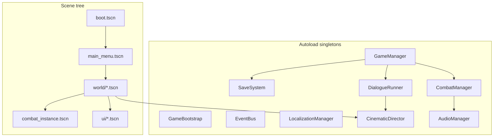

# Technical Design — Design principles + runtime architecture

**Hub:** [`TECHNICAL_DESIGN.md`](../TECHNICAL_DESIGN.md)

## When to read

Use **Technical Design — Design principles + runtime architecture** (roles: architect, builder) when you need this reference during the current task Jump to a section below instead of reading end-to-end (4 sections).

## Jump to

- [1. Design principles](#1-design-principles)
- [2. Runtime architecture](#2-runtime-architecture)
- [Autoload registry (target — Phase 2+)](#autoload-registry-target-phase-2)
- [2.1 Code base classes (extend-only)](#21-code-base-classes-extend-only)

## 1. Design principles

| Principle | Detail |
|-----------|--------|
| **Data-driven** | Combat, dialogue, quests, encounters live in `game/data/*.json` |
| **Story spine first** | `scenes.json` → flags → quests → content (`DATA_ARCHITECTURE.md`) |
| **Thin scenes, fat autoloads** | Zone `.tscn` files place geometry + triggers; systems live in autoloads |
| **Extend base classes** | `PlayerController`, `Combatant`, `Interactable` — see `CODE_BASE_CLASS_RULES.md` |
| **Signals over polling** | `EventBus` for cross-system events; typed `.connect()` only |
| **No FMV** | Cinematics = `Camera3D` + `CinematicDirector` + audio (`CINEMATICS.md`) |
| **Single save slot v1** | `user://save_slot_0.json` — schema in `SAVE_AND_FAIL_STATES.md` |

---

## 2. Runtime architecture

### Autoload registry (target — Phase 2+)

**Specification:** `game/data/code/autoload_registry.json` (on `main`).
**Implementation:** `game/development` only after `SPEC_DEV_START`.

| Autoload | Script | Responsibility |
|----------|--------|----------------|
| `GameBootstrap` | `scripts/core/game_bootstrap.gd` | Startup JSON path checks |
| `GameManager` | `scripts/core/game_manager.gd` | Flag state, scene progression, `load_json()` API |
| `EventBus` | `scripts/core/event_bus.gd` | Global signals (locale, combat, story) |
| `SaveSystem` | `scripts/core/save_system.gd` | Serialize/deserialize save slot |
| `LocalizationManager` | `scripts/core/localization_manager.gd` | Locale, CSV, font routing |
| `AudioManager` | `scripts/audio/audio_manager.gd` | BGM crossfade, SFX, bus ducking |
| `DialogueRunner` | `scripts/narrative/dialogue_runner.gd` | Line playback, choices, `voice_id` → `VoiceLinePlayer` |
| `CombatManager` | `scripts/combat/combat_manager.gd` | Battle lifecycle, links UI + turn system |
| `CinematicDirector` | `scripts/story/cinematic_director.gd` | Hook registry, gating, `then` chain |

**Build:** Register autoloads in `project.godot` on `game/development` as each phase lands. Scenes via **GDAI MCP only** (Phase 1+).

### 2.1 Code base classes (extend-only)

Gameplay entities **extend** Architect-owned scripts — Builder instantiates component `.tscn` prefabs, never forks new controller stacks.

| `class_name` | Script | Instanced by |
|--------------|--------|--------------|
| `PlayerController` | `scripts/exploration/player_controller.gd` | `player.tscn` |
| `Combatant` | `scripts/combat/combatant.gd` | Enemy/party prefabs |
| `Interactable` | `scripts/exploration/interactable.gd` | `interactable_*.tscn` catalog |
| `SavePoint` | `scripts/exploration/save_point.gd` | `save_point.tscn` |

**Registry:** `game/data/code/base_classes.json` · **Rules:** `docs/engineering/technical/CODE_BASE_CLASS_RULES.md` · **Component catalog:** `docs/design/world/LEVEL_DESIGN.md` §1b · **CI:** `L0_base_classes`, `L0_base_class_compliance`, `L1_gdscript_lint`.

---
