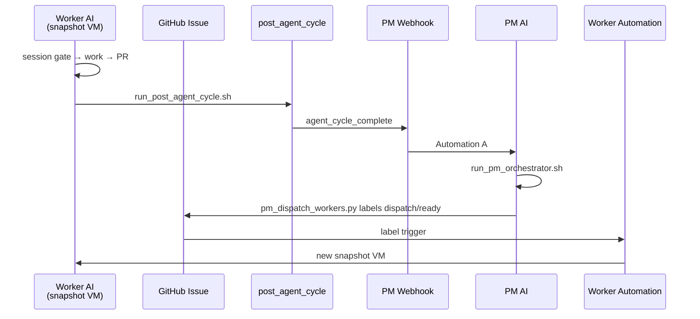

# Factory Setup Guide — 100% AI Multi-Agent Development (snapshot boot)

**Version:** 1.0
**Authority:** End-to-end setup for event-driven PM orchestration + worker Cloud Agents on **snapshot** VMs. Human only at **L6 UAT**.
**Cross-refs:** `docs/ops/agents/CLOUD_AGENT_SETUP_RUNBOOK.md` · `docs/ops/agents/CLOUD_SNAPSHOT_LAUNCH.md` · `game/data/qa/factory_automations.json`

---

## 1. What you are building

| Goal | Mechanism |
|------|-----------|
| PM auto-orchestration | **Automation A** webhook → `run_pm_orchestrator.sh` |
| Worker auto-dispatch | `pm_dispatch_workers.py` → GitHub label `dispatch/ready` → **Automation E** |
| Every implementation agent on snapshot | Saved Environment + `check_snapshot_boot.sh` gate |
| No cron | Event-driven only (`agent_cycle_complete` webhook) |
| Human at end only | `uat_ready` → L6 playtest (`docs/ops/qa/PLAYTEST_SCRIPT.md`) |



---

## 2. Control boundaries (read this first)

| You control (repo + scripts) | Cursor team owner controls (dashboard) |
|------------------------------|----------------------------------------|
| `game/data/qa/sprint_board.json` | Saving Environment **snapshot** |
| `pm_dispatch_workers.py` | Creating **Automations** at cursor.com/automations |
| Webhook **payload** scripts | Pasting automation **prompts** from `docs/ops/agents/automation_prompts/` |
| CI workflows posting webhooks | **Integrations & MCP** server registration |
| Preflight / snapshot boot **gates** | Cursor Secrets UI |

**Repo cannot force snapshot boot** — it can **detect JIT boot and halt dispatch**.

Verify repo wiring anytime:

```bash
bash tools/check_factory_automation_setup.sh
python3 tools/validate_factory_automations.py   # L0_factory_automations
```

---

## 3. Phase 1 — Snapshot (one-time, human)

**Dashboard:** [Cloud Agents → Environments](https://cursor.com/dashboard/cloud-agents/environments/r/github.com/vivivieri/3d-jrpg-adventure-pc-game)

1. **Start Setup Agent** on branch `game/development` (not ad-hoc web chat).
2. Upload commercial zips to `game/addons/`:
   - `gdai-mcp-plugin-godot-*.zip`
   - `godot-mcp-pro*.zip`
3. Run:

   ```bash
   bash tools/rebuild_cloud_snapshot.sh
   ```

4. Enable Godotiq editor plugin (`docs/ops/agents/CLOUD_SNAPSHOT_LAUNCH.md` §4 step 4a).
5. Confirm:

   ```bash
   bash tools/check_mcp_ready.sh
   curl -sf http://127.0.0.1:3571/tools | head -c 100
   ```

6. **Save snapshot** in dashboard → copy id into `.cursor/environment.json`:

   ```json
   {
     "snapshot": "snapshot-YYYYMMDD-…",
     "install": "bash tools/install_cloud_dev.sh",
     "start": "bash tools/ensure_mcp_stack.sh"
   }
   ```

7. Commit and push on `game/development`.

**Pass:** new agent from Environment dashboard shows GDAI plugin on disk and `check_snapshot_boot.sh` PASS.

---

## 4. Phase 2 — Secrets (Environment → Secrets)

All day-one secrets (11, incl. webhook auth) — see `docs/ops/agents/CURSOR_SECRETS_SETUP.md`.

```bash
bash tools/check_day_one_secrets.sh
```

Mirror webhook **URL + auth** pairs in **GitHub repo Secrets** for Actions:

```bash
bash tools/setup_github_actions_secrets.sh
```

Agents must POST webhooks only via `tools/curl_cursor_webhook.sh` (`pm` | `alert` | `worker`) — see `game/data/qa/factory_automations.json` → `webhook_dispatch`.

---

## 5. Phase 3 — MCP (Dashboard → Integrations & MCP)

| Server | Required for |
|--------|----------------|
| `godot-mcp` | Builder (GDAI) |
| `godotiq` | Debug / perf |
| `godot-mcp-pro` | Flow L4/L5 |
| `gamelab-mcp` | UI art |

GameLab SSE config: `docs/ops/agents/CLOUD_SNAPSHOT_LAUNCH.md` §5.

---

## 6. Phase 4 — Cursor Automations (dashboard)

Machine-readable catalog: `game/data/qa/factory_automations.json`
Prompt files: `docs/ops/agents/automation_prompts/`

### Automation A — PM cycle dispatch (required)

| Field | Value |
|-------|--------|
| Trigger | **Webhook** → `CURSOR_PM_CYCLE_WEBHOOK_URL` |
| Repo / branch | `3d-JRPG-adventure-pc-game` / `game/development` |
| Schedule | **None** |
| Prompt | Paste `docs/ops/agents/automation_prompts/pm_cycle_dispatch.md` |

### Automation B — CI failure triage (required)

Handled by `.github/workflows/game-ci-failure-triage.yml` posting to PM webhook.
Optional duplicate in Cursor automations on **CI failure** for `Game CI` on `game/development`.
Prompt: `docs/ops/agents/automation_prompts/ci_failure_triage.md`

### Automation C — UAT notify (optional)

Webhook on `uat_ready` only. Prompt: `docs/ops/agents/automation_prompts/uat_notify.md`

### Automation D — Factory alert (required)

| Field | Value |
|-------|--------|
| Trigger | Webhook → `CURSOR_FACTORY_ALERT_WEBHOOK_URL` |
| Prompt | `docs/ops/agents/automation_prompts/factory_alert.md` |

### Automation E — Worker (required for 100% automation)

This closes the **worker spawn gap**.

> **Cursor UI note:** Many accounts only show **PR label** triggers, not **issue label** triggers. Use the **webhook + GitHub Actions** bridge below instead of a GitHub label trigger in Cursor.

| Field | Value |
|-------|--------|
| Name | `Worker — sprint issue` |
| Trigger | **Webhook** → `CURSOR_WORKER_WEBHOOK_URL` |
| Repo / branch | `3d-JRPG-adventure-pc-game` / `game/development` |
| Tools | MCP **on** (all Godot MCPs + gamelab) |
| Prompt | Paste `docs/ops/agents/automation_prompts/worker_sprint_issue.md` |

**GitHub Actions bridge** (repo workflow `.github/workflows/worker-dispatch.yml`):

1. Save Automation E with **Webhook** trigger → copy URL
2. GitHub → **Settings → Secrets and variables → Actions** → `CURSOR_WORKER_WEBHOOK_URL` = same URL
3. Merge `worker-dispatch.yml` to `game/development` (fires on `issues.labeled` → `dispatch/ready`)

**How PM triggers it:** orchestrator step `dispatch_workers` runs:

```bash
python3 tools/pm_dispatch_workers.py --head-only
```

That adds labels `dispatch/ready`, `status/in-progress`, `agent/<role>` on the linked GitHub issue and writes `artifacts/worker_dispatch_manifest.json`.

> **Cursor UI note:** If your automations UI only shows repo/branch (no explicit “Environment” dropdown), automations still reuse the **saved Environment for the same repo** when configured. Confirm with `environment-info` → non-null `build.snapshotId` after a test run.

---

## 7. Phase 5 — GitHub labels + issues

```bash
export GH_TOKEN=…
bash tools/setup_github_project.sh
bash tools/setup_github_actions_secrets.sh   # needs GH_TOKEN Secrets write
```

Creates `dispatch/ready`, `agent/*`, `status/*` labels.

For full automation, enable GitHub issue links on the sprint board:

1. Set `orchestration.require_github_issues: true` in `game/data/qa/sprint_board.json`
2. Create issues:

   ```bash
   python3 tools/pm_sync_github_issues.py --create
   ```

---

## 8. Phase 6 — Bootstrap factory loop

From an Environment-launched PM agent:

```bash
bash tools/run_pm_orchestrator.sh
python3 tools/pm_dispatch_workers.py --dry-run   # inspect manifest
bash tools/run_post_agent_cycle.sh --issue P1-00 --agent pm --commit $(git rev-parse HEAD)
```

Test webhook:

```bash
bash tools/pm_emit_cycle_event.sh agent_cycle_complete --issue P1-00 --agent pm --note "factory bootstrap"
```

PM Automation should start within seconds.

---

## 9. Steady-state loop (no human)

1. **Worker** (Automation E, snapshot VM): `run_agent_session_gate.sh` → work → PR → `run_post_agent_cycle.sh`
2. **Webhook** → Automation A (PM)
3. **PM**: `run_pm_orchestrator.sh` → `pm_dispatch_workers.py`
4. **GitHub** issue labeled `dispatch/ready` → Automation E → new Worker snapshot VM
5. Repeat until `sprint_complete` → PM closes sprint → next pack
6. After L5 on RC: `uat_ready` → **you** run L6 only

---

## 10. Audit existing setup

### Repo-side (run now)

```bash
bash tools/check_factory_automation_setup.sh
bash tools/run_docs_ci_checks.sh   # includes L0_factory_automations
```

### Per agent run (snapshot proof)

```bash
bash tools/check_snapshot_boot.sh
bash tools/check_mcp_ready.sh
```

Or ask agent to run **cursor-cloud `environment-info`** — need `build.snapshotId`, not `build: null`.

### Dashboard checklist (human)

- [ ] Snapshot id in dashboard matches `.cursor/environment.json`
- [ ] Automation A active — URL + `CURSOR_PM_WEBHOOK_AUTH` in Secrets + GitHub
- [ ] Automation D active — URL + `CURSOR_ALERT_WEBHOOK_AUTH`
- [ ] Automation E active — URL + `CURSOR_WORKER_WEBHOOK_AUTH`
- [ ] Automation E triggers on label `dispatch/ready`
- [ ] All automations use `game/development`, not `main`
- [ ] MCP servers registered (4)
- [ ] Test cycle: worker end → PM wakes < 60s → worker label applied

### Common failures

| Symptom | Fix |
|---------|-----|
| `build: null` | Launch from Environment dashboard, not web/GitHub ad-hoc agent |
| Worker never starts | `github_issue` null → `pm_sync_github_issues.py --create`; check Automation E trigger |
| PM never wakes | Wrong URL/auth or Automation A inactive — `bash tools/curl_cursor_webhook.sh pm @artifacts/agent_cycle_event.json` |
| MCP FAIL on worker | Rebuild snapshot (`rebuild_cloud_snapshot.sh`) |
| Factory stall | Worker skipped `run_post_agent_cycle.sh` → `run_factory_watchdog.sh --recover` |

---

## 11. Anti-patterns

| Do not | Why |
|--------|-----|
| Start implementation agents from ad-hoc web chat | JIT boot — no GDAI |
| Use `main` for Builder work | No Godot project / MCP stack |
| Cron-schedule PM | Rejected — event-driven only |
| Skip Automation E | Workers never auto-spawn |
| Automate L6 playtest | Required human ship gate |

---

## 12. Cross-refs

| Doc | Topic |
|-----|--------|
| `docs/ops/agents/CLOUD_AGENT_SETUP_RUNBOOK.md` | Event architecture + automation prompts index |
| `docs/ops/agents/CLOUD_SNAPSHOT_LAUNCH.md` | Snapshot rebuild + Godotiq enable |
| `docs/ops/agents/PM_AGENT_RUNBOOK.md` | PM session steps |
| `docs/ops/agents/SPRINT_ORCHESTRATION.md` | Board + gates |
| `docs/ops/agents/CURSOR_SECRETS_SETUP.md` | All secrets |
| `game/data/qa/factory_automations.json` | Automation catalog (CI validated) |
