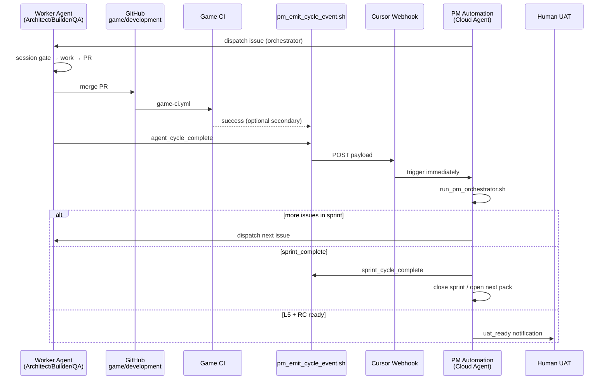

# Cloud Agent Setup — Goal & architecture

**Hub:** [`CLOUD_AGENT_SETUP_RUNBOOK.md`](../CLOUD_AGENT_SETUP_RUNBOOK.md)

## When to read

Use **Cloud Agent Setup — Goal & architecture** (roles: pm, builder) when executing this procedure Jump to a section below instead of reading end-to-end (3 sections).

## Jump to

- [1. Goal](#1-goal)
- [2. Architecture (event-driven)](#2-architecture-event-driven)
- [Cycle types](#cycle-types)

## 1. Goal

| You want | How this repo does it |
|----------|------------------------|
| Set up once | Cloud **environment snapshot** + Secrets + MCP dashboard |
| Agents run in sequence with quality gates | `sprint_board.json` + `run_pm_orchestrator.sh` + `run_agent_session_gate.sh` |
| **No daily/hourly cron** | **Event-driven PM** — next cycle starts when the **last cycle ends** |
| Stop for human | **L6 UAT** after L0–L5 on RC (`docs/ops/qa/PLAYTEST_SCRIPT.md`) |

**Rejected:** PM Automation on `0 9 * * *` (or any fixed interval). AI agents do not need sleep; wall-clock schedules waste time between cycles.

---

## 2. Architecture (event-driven)

### Cycle types

| Cycle | Ends when | Event emitted | What runs next |
|-------|-----------|---------------|----------------|
| **Micro** (one issue) | Issue `done` on board + PR merged/pushed | `agent_cycle_complete` | **PM** → orchestrator → next worker |
| **Sprint** | All sprint issues `done` | `sprint_cycle_complete` | **PM** → `pm_close_sprint.py` → new sprint pack |
| **Phase** | Phase exit gates PASS | `sprint_cycle_complete` + RC tag | **PM** → optional `uat_ready` after L5 |
| **UAT** | L0–L5 green on RC | `uat_ready` | **Human** only — not another worker |

Machine-readable: `game/data/qa/agent_cycle_events.json`

---
