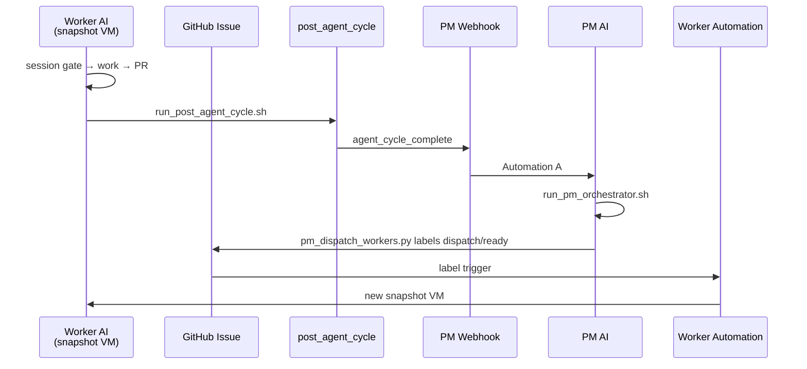

# Factory Setup Guide — What you build + control boundaries

**Hub:** [`FACTORY_SETUP_GUIDE.md`](../FACTORY_SETUP_GUIDE.md)

## 1. What you are building

| Goal | Mechanism |
|------|-----------|
| PM auto-orchestration | **Automation A** webhook → `run_pm_orchestrator.sh` |
| Worker auto-dispatch | `pm_dispatch_workers.py` → GitHub label `dispatch/ready` → **Automation E** |
| Every implementation agent on snapshot | Saved Environment + `check_snapshot_boot.sh` gate |
| No cron | Event-driven only (`agent_cycle_complete` webhook) |
| Human at end only | `uat_ready` → L6 playtest (`docs/ops/qa/PLAYTEST_SCRIPT.md`) |



---


## 2. Control boundaries (read this first)

| You control (repo + scripts) | Cursor team owner controls (dashboard) |
|------------------------------|----------------------------------------|
| `game/data/qa/sprint_board.json` | Saving Environment **snapshot** |
| `pm_dispatch_workers.py` | Creating **Automations** at cursor.com/automations |
| Webhook **payload** scripts | Pasting automation **prompts** from `docs/ops/agents/automation_prompts/` |
| CI workflows posting webhooks | **Integrations & MCP** server registration |
| Preflight / snapshot boot **gates** | Cursor Secrets UI |

**Repo cannot force snapshot boot** — it can **detect JIT boot and halt dispatch**.

Verify repo wiring anytime:

```bash
bash tools/check_factory_automation_setup.sh
python3 tools/validate_factory_automations.py   # L0_factory_automations
```

---
