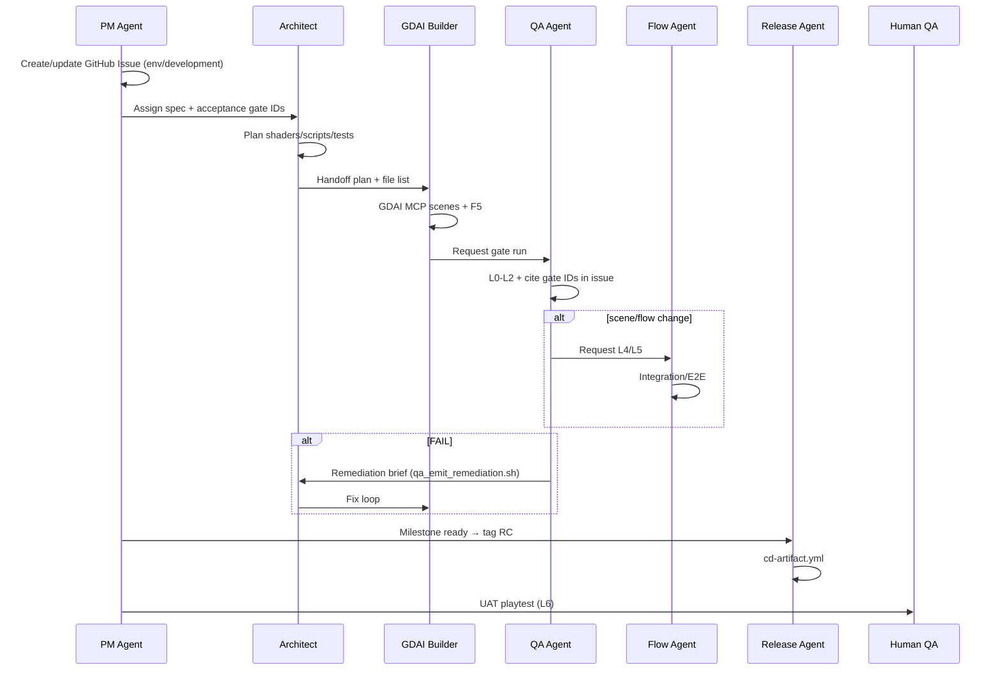

# Multi-Agent Team — Why, roster, session lifecycle

**Hub:** [`MULTI_AGENT_TEAM.md`](../MULTI_AGENT_TEAM.md)

## 1. Why multi-agent

One agent doing plan + build + test + deploy violates R&R and skips gates. This doc defines **roles** that map to **tools** and **handoffs** — simulating a 6-person indie team.

---

## 2. Team roster

| Role | Agent name | Primary tools | Owns | Must NOT |
|------|------------|---------------|------|----------|
| **Product / PM** | PM Agent | GitHub Issues, optional Linear/Notion MCP | Milestones, issue triage, env promotion, **sprint facilitator** — **`run_pm_orchestrator.sh` required** | Write `.tscn` or game code |
| **Tech Lead / Architect** | GodotPrompter | Cursor, `docs/`, `game/data/` | Plans, `.gd`, `.gdshader`, unit tests, refactors | Hand-edit scenes |
| **Gameplay Builder** | GDAI Builder | `godot-mcp` (GDAI) | `.tscn`, materials, lights, F5 | Replace architect for system design |
| **QA Engineer** | QA Agent | `run_ci_checks.sh`, `run_playtest_smoke.sh`, jury scripts | L0–L2 gates, evidence paths, bug reports | Mark ship without gates |
| **Integration Tester** | Flow Agent | `godot-mcp-pro`, `run_integration_tests.sh`, `run_e2e_playthrough.sh` | L4/L5 scenarios, asserts | Build scenes |
| **Debugger** | Analyze Agent | `godotiq` | Signals, `trace_flow`, debug console | Scene mutations |
| **Release Engineer** | Release Agent | `run_cd_gates.sh`, tags, CD workflows | RC/beta/prod tags, export | Feature implementation |
| **Art Reviewer** | Visual Agent | `docs/design/art/ART_DIRECTION.md`, palette/jury tools | L2 visual/model/audio/vo jury evidence | Bypass jury with "looks fine" |
| **Factory Analyst** | Analyst Agent | `analyze_agent_session_telemetry.py`, `pm_refresh_agent_telemetry.sh` | Token/duration rollups, sprint efficiency reports (`artifacts/agent_session_reports/`) | Write game code or scenes |
| **Human QA Lead** | Human | `docs/ops/qa/PLAYTEST_SCRIPT.md` | L6 UAT sign-off | Before L0–L5 pass |

---

## 3. Session lifecycle (one feature)

---
