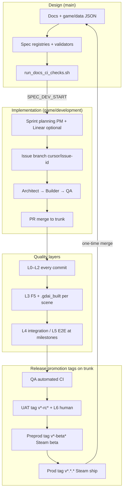

# Development Lifecycle — Doc map, overview, time model

**Hub:** [`DEVELOPMENT_LIFECYCLE.md`](../DEVELOPMENT_LIFECYCLE.md)

## 1. Do we have one document for this?

**Before v1.0:** Lifecycle knowledge was **split** across several docs:

| Topic | Former home |
|-------|-------------|
| Branch policy | `BRANCHING.md` |
| Environment stages (dev/qa/uat/…) | `ENVIRONMENTS.md` |
| Build phases 0–8 | `IMPLEMENTATION_PLAN.md` |
| Sprints inside phases | `AGILE_WITHIN_PHASES.md` |
| Per-issue branches | `MULTI_AGENT_BRANCH_STRATEGY.md` |
| Agent handoffs | `MULTI_AGENT_TEAM.md` |
| AI build + test policy | `AI_DEV_WORKFLOW.md` |
| CI/CD | `CI.md`, `CD.md` |

**This document** is the **integration layer** — read it first for the full picture, then drill into the linked docs for detail.

---

## 2. Lifecycle overview (macro)

### Stage map

| Stage | What it means | Git ref | Agent / human | Exit signal |
|-------|---------------|---------|---------------|-------------|
| **Design** | Specs, story JSON, validators | `main` | PM, Architect | `run_docs_ci_checks.sh` PASS |
| **Development** | Daily Godot implementation | `game/development` + `cursor/*` | Architect, Builder | PR merged; local gates green |
| **QA** | Automated acceptance gates | Same trunk @ CI-green commit | QA Agent | `run_ci_checks.sh` PASS in Actions |
| **UAT** | RC build + stakeholder playtest | Trunk @ tag `v*-rc*` / `v*-uat*` | PM, Human (L6) | `PLAYTEST_SCRIPT.md` sign-off |
| **Preproduction** | Steam beta (near-ship) | Trunk @ tag `v*-beta*` | Release Agent | Beta soak; no open S0/S1 |
| **Production** | Public Steam release | Trunk @ tag `v*.*.*` | Release + PM | Ship + compliance PASS |

**Important:** Dev, QA, UAT, preprod, and prod are **promotion stages**, not separate long-lived git branches. See `BRANCHING_DECISION_RECORD.md` for why.

---

## 3. Two-layer time model

### Layer A — Waterfall roadmap (phases 0–8)

Fixed order from `IMPLEMENTATION_PLAN.md`. Sprints do **not** reorder phases.

| Phase | Focus | Trunk | Milestone |
|-------|-------|-------|-----------|
| 0 | Docs/data baseline | `main` | M0 ✅ |
| 1 | SC-02 vertical slice | `game/development` | — |
| 2–6 | Gameplay systems → three endings | `game/development` | M1–M4 |
| 7 | M5 art rebuild | `game/development` | M5 |
| 8 | M6 Steam ship | `game/development` | M6 |

Phase exit = all `required_gates` for that phase in `acceptance_criteria.json`.

### Layer B — Agile sprints (inside each phase)

| Concept | Tool | Cadence |
|---------|------|---------|
| Sprint batch | Linear cycle (optional) + `sprint_board.json` | ≤10 issues; close on gate evidence |
| Task content | GitHub Issues + `docs/ops/sprints/*-issues.md` | Per issue |
| Dispatch | `run_pm_orchestrator.sh` | Every PM session |

See `AGILE_WITHIN_PHASES.md` for ceremony and AI-native micro-cycles.

---
