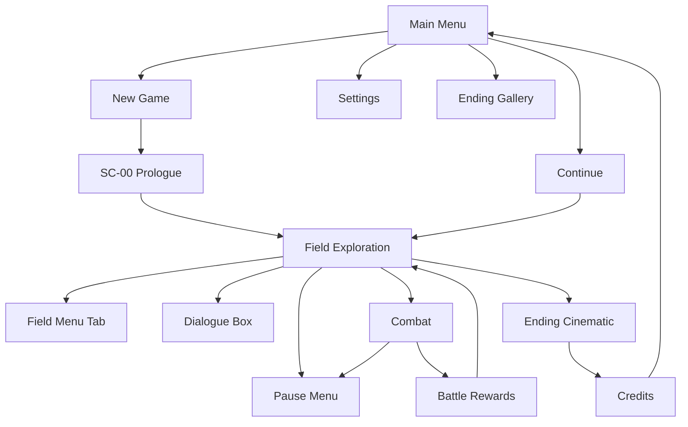

# Tides of Urashima — UI / UX Flow

**Version:** 1.0 (Pre-build)  
**Cross-refs:** `docs/gameplay/TUTORIAL_DESIGN.md`, `docs/ui/CINEMATICS.md`, `docs/art/ART_DIRECTION.md` §4

---

## 1. Screen map



---

## 2. Main menu

| Option | Condition | Action |
|--------|-----------|--------|
| New Game | always | SC-00 → beach_shore |
| Continue | save exists | Last save slot |
| Ending Gallery | `game_completed` once | View unlocked endings |
| Settings | always | Settings overlay |
| Quit | always | Desktop exit |

**Title art:** Muted coastal; box motif; `Noto Serif JP` title

---

## 3. HUD — field

| Element | Position | Notes |
|---------|----------|-------|
| Interaction prompt | Center-bottom | "E — Investigate" localized |
| Quest tracker | Top-right | Active stage title only |
| Party HP (optional) | Top-left | Small bars post-Yuzu join |
| Area name | Top-center fade | On zone enter, 2s |

**No minimap v1.** `cave_map` key item adds journal text only.

---

## 4. Field menu (Tab)

| Tab | Contents |
|-----|----------|
| **Items** | Consumables; Use / Sell |
| **Equipment** | 3 slots × active party; compare stats |
| **Party** | 3 members; stats; skills list (read-only) |
| **Quests** | Active + completed main quests |
| **Lore** | 8 entries; unread dot |
| **Shop** | Only near Roku shack |

**Pause:** Esc opens overlay — Resume, Settings, Save, Return to Title.
**Pause → Save** writes the autosave slot; available anywhere in the field **except mid-combat and
during SC-16** — it does not replace SavePoints (well/palace gate remain the "ritual" manual saves
with their own toast; `SAVE_AND_FAIL_STATES.md` §1).

---

## 5. Dialogue box

| Field | Spec |
|-------|------|
| Position | Lower third |
| Background | `#1A1A2ECC` ink panel |
| Portrait | Left 128×128; character bust |
| Text | Typewriter 40 cps; click to advance |
| Speaker | Gold nameplate |
| Choices | Max 3; vertical list SC-13 |

**Auto-advance:** Off default; option in Settings

---

## 6. Combat UI

```
┌─────────────────────────────────────────┐
│ [Enemy intent icons]     Enemy HP bars  │
├─────────────────────────────────────────┤
│                                         │
│   Battle stage (3D arena, fixed cam)    │
│                                         │
├─────────────────────────────────────────┤
│ Party HP/MP/Limit    │ Action menu       │
│ Battle log (scroll)  │ Attack/Skill/... │
└─────────────────────────────────────────┘
```

| State | Input |
|-------|-------|
| Player turn | Menu + target select |
| Target select | Highlight valid targets; Esc back |
| Enemy turn | Input locked |
| Victory | Rewards overlay |

**Action menu order:** Attack → Skill → Item → Defend → Escape

---

## 7. Battle rewards

| Field | Display |
|-------|---------|
| XP gained | Number + bar fill |
| Shell coins | +N |
| Items | Icons if dropped |
| Level up | If applicable → skill unlock toast |

Confirm or 3s auto-advance.

---

## 8. Choice UI (SC-16)

- Full-screen dim overlay 60% black
- 3 vertical cards with label + subtext
- Cursor / gamepad default: no selection until moved
- Two-step confirm modal

---

## 9. Game Over

- Desaturate 0.5s
- "The tide claims you" (localized)
- Options: **Load Save** | **Title**

No retry-in-place v1.

---

## 10. Input — keyboard & mouse

| Context | Keys |
|---------|------|
| Field move | WASD |
| Interact | E |
| Menu | Tab |
| Pause | Esc |
| Confirm | Space / Enter / LMB |
| Cancel | Esc / RMB |
| Camera | RMB drag, scroll zoom |

### Canonical InputMap action names (`project.godot`)

Use exactly these action IDs in GDScript and scene wiring — do not invent variants:

| Action ID | Keyboard | Gamepad |
|-----------|----------|---------|
| `move_left` / `move_right` / `move_forward` / `move_back` | A / D / W / S | Left stick |
| `interact` | E | A |
| `ui_accept` (built-in) | Space / Enter | A |
| `ui_cancel` (built-in) | Esc | B |
| `open_menu` | Tab | Y |
| `pause` | Esc | Start |
| `camera_orbit` | RMB (hold) | Right stick |
| `camera_zoom_in` / `camera_zoom_out` | Scroll up / down | — (auto-frame) |
| `dialogue_advance` | Space / Enter / E | A |
| `skip_hold` (prologue/cinematic skip) | Confirm held 1 s | A held 1 s |

---

## 11. Controller (Xbox layout)

**Ship target:** Full main-path playable on gamepad (M5 polish). No remapping v1.

| Action | Button |
|--------|--------|
| Move | Left stick |
| Interact | A |
| Confirm | A |
| Cancel | B |
| Menu | Y |
| Pause | Start |
| Camera | Right stick |

**Combat:** D-pad menu navigate; A confirm; B back

### SC-16 choice (gamepad)

| Rule | Detail |
|------|--------|
| Default focus | **No** option pre-selected |
| Navigate | D-pad up/down between 3 cards |
| Select | A on card → confirm modal |
| Confirm ending | A on "Are you certain?" |
| Back | B returns to card selection |
| Blocked | Attack/combat inputs disabled |

See `ENDING_DESIGN.md` §2 and `GAME_FEEL.md` §6.

---

## 12. QA checklist

- [ ] Tab menu pauses field movement
- [ ] Combat Esc does not open field pause
- [ ] All screens reachable with controller
- [ ] Lore unread indicator clears on read
- [ ] SC-16 choice requires deliberate confirm
