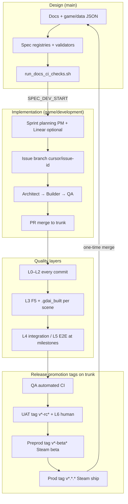
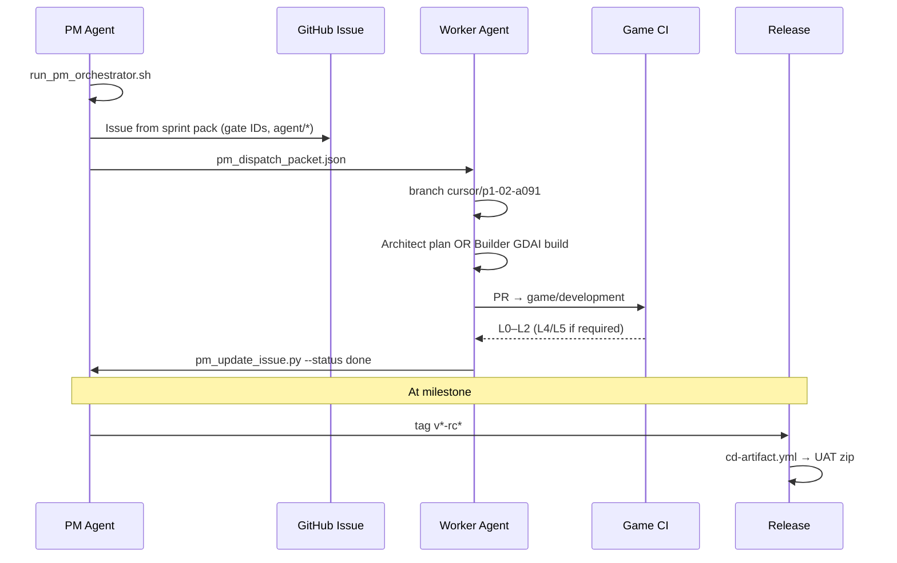

# Development Lifecycle — End-to-End

**Version:** 1.0  
**Authority:** Single hub for how work flows from spec → ship.  
**Machine-readable:** `game/data/qa/environments.json`, `game/data/qa/sprint_phases.json`, `game/data/qa/sprint_board.json`  
**Branching ADR:** `docs/workflow/BRANCHING_DECISION_RECORD.md`

---

## 1. Do we have one document for this?

**Before v1.0:** Lifecycle knowledge was **split** across several docs:

| Topic | Former home |
|-------|-------------|
| Branch policy | `BRANCHING.md` |
| Environment stages (dev/qa/uat/…) | `ENVIRONMENTS.md` |
| Build phases 0–8 | `IMPLEMENTATION_PLAN.md` |
| Sprints inside phases | `AGILE_WITHIN_PHASES.md` |
| Per-issue branches | `MULTI_AGENT_BRANCH_STRATEGY.md` |
| Agent handoffs | `MULTI_AGENT_TEAM.md` |
| AI build + test policy | `AI_DEV_WORKFLOW.md` |
| CI/CD | `CI.md`, `CD.md` |

**This document** is the **integration layer** — read it first for the full picture, then drill into the linked docs for detail.

---

## 2. Lifecycle overview (macro)



### Stage map

| Stage | What it means | Git ref | Agent / human | Exit signal |
|-------|---------------|---------|---------------|-------------|
| **Design** | Specs, story JSON, validators | `main` | PM, Architect | `run_docs_ci_checks.sh` PASS |
| **Development** | Daily Godot implementation | `game/development` + `cursor/*` | Architect, Builder | PR merged; local gates green |
| **QA** | Automated acceptance gates | Same trunk @ CI-green commit | QA Agent | `run_ci_checks.sh` PASS in Actions |
| **UAT** | RC build + stakeholder playtest | Trunk @ tag `v*-rc*` / `v*-uat*` | PM, Human (L6) | `PLAYTEST_SCRIPT.md` sign-off |
| **Preproduction** | Steam beta (near-ship) | Trunk @ tag `v*-beta*` | Release Agent | Beta soak; no open S0/S1 |
| **Production** | Public Steam release | Trunk @ tag `v*.*.*` | Release + PM | Ship + compliance PASS |

**Important:** Dev, QA, UAT, preprod, and prod are **promotion stages**, not separate long-lived git branches. See `BRANCHING_DECISION_RECORD.md` for why.

---

## 3. Two-layer time model

### Layer A — Waterfall roadmap (phases 0–8)

Fixed order from `IMPLEMENTATION_PLAN.md`. Sprints do **not** reorder phases.

| Phase | Focus | Trunk | Milestone |
|-------|-------|-------|-----------|
| 0 | Docs/data baseline | `main` | M0 ✅ |
| 1 | SC-02 vertical slice | `game/development` | — |
| 2–6 | Gameplay systems → three endings | `game/development` | M1–M4 |
| 7 | M5 art rebuild | `game/development` | M5 |
| 8 | M6 Steam ship | `game/development` | M6 |

Phase exit = all `required_gates` for that phase in `acceptance_criteria.json`.

### Layer B — Agile sprints (inside each phase)

| Concept | Tool | Cadence |
|---------|------|---------|
| Sprint batch | Linear cycle (optional) + `sprint_board.json` | ≤10 issues; close on gate evidence |
| Task content | GitHub Issues + `docs/sprints/*-issues.md` | Per issue |
| Dispatch | `run_pm_orchestrator.sh` | Every PM session |

See `AGILE_WITHIN_PHASES.md` for ceremony and AI-native micro-cycles.

---

## 4. Branching mechanism (summary)

Full policy: `BRANCHING.md` · per-agent rules: `MULTI_AGENT_BRANCH_STRATEGY.md`

```
main                          ← design + game/data only (never ship .gd/.tscn)
  │
game/development              ← implementation trunk (all phases 1–8)
  │
cursor/<issue-id>-<suffix>     ← one issue, one branch, one PR → trunk
```

| Branch type | Lifetime | Who creates | Merges into |
|-------------|----------|-------------|-------------|
| `main` | Permanent | Humans / PM (docs) | — |
| `game/development` | Permanent | Bootstrap once | `main` **once at M6 ship** |
| `cursor/p1-02-a091` | Days (1 issue) | Worker agent | `game/development` |

**Release promotion uses tags on `game/development`, not branch merges:**

```bash
git tag v0.8.0-rc1 && git push origin v0.8.0-rc1    # UAT artifact
git tag v0.9.0-beta1 && git push origin v0.9.0-beta1  # Steam beta
git tag v1.0.0 && git push origin v1.0.0              # Production
```

---

## 5. Agent environments (isolation model)

Agents do **not** each get a permanent fork or environment branch. Isolation is **per session / per issue**.

| Role | Works on | Runtime environment | Isolation mechanism |
|------|----------|---------------------|---------------------|
| **PM** | `main` or `game/development` | Cloud agent (light on `main`) | Orchestrator + sprint board |
| **Architect** | `cursor/*` or trunk | Cloud snapshot on `game/development` | Feature branch + typed GDScript only |
| **Builder** | `cursor/*` | Cloud snapshot + **full MCP stack** | Feature branch; GDAI-only `.tscn` |
| **QA** | Trunk @ PR commit | CI runner or local `run_ci_checks.sh` | Read-only verification |
| **Flow** | Trunk @ milestone | MCP Pro test mode | Scenario scripts only |
| **Release** | Tagged commit | CD workflows | Tag + GitHub Environment approval |
| **Human** | UAT RC zip | Local install | L6 after L0–L5 |

### Cloud Agent branch rule

| Checkout branch | Godot / MCP | Use for |
|-----------------|-------------|---------|
| `main` | **Not booted** | Docs, `game/data/`, validators |
| `game/development` | **Required** | All implementation |

Launch cloud agents from the `game/development` environment snapshot for Builder work (`docs/agents/CLOUD_SNAPSHOT_LAUNCH.md`).

### Session gate (every worker agent)

```bash
bash tools/run_agent_session_gate.sh <role> <issue_id>
```

Enforces: correct role, issue in `next_dispatch`, WIP caps, MCP preflight.

---

## 6. Issue lifecycle (one sprint task)



### Definition of done (issue)

- [ ] Acceptance gate IDs listed and **PASS**
- [ ] Evidence paths in issue or PR
- [ ] PR merged to correct branch (`game/development` for code)
- [ ] `pm_check_done_criteria.py` PASS
- [ ] Linear issue closed (if mirrored)

Templates: `.github/ISSUE_TEMPLATE/` · sprint pack: `docs/sprints/Phase1-Sprint1-issues.md`

---

## 7. Quality gate ladder (when each stage runs)

| Layer | When | Command / owner | Blocks |
|-------|------|-----------------|--------|
| **L0** | Every commit | `validate_story_data.py`, R&R compliance | Data + policy |
| **L1** | Every commit | `run_unit_tests.sh`, gdlint | Logic regressions |
| **L2** | Every commit / when assets exist | smoke, visual/audio/model jury | Art/audio tech |
| **L3** | Scene change | GDAI F5 + `.gdai_built` | Broken scenes |
| **L4** | Phase 2+ milestones | `run_integration_tests.sh` | Flow scenarios |
| **L5** | Phase 6+ | `run_e2e_playthrough.sh` | Three endings |
| **L6** | UAT only | Human `PLAYTEST_SCRIPT.md` | Ship sign-off |

**QA stage** = L0–L2 (and L4/L5 when phase requires) automated on trunk.  
**UAT stage** = tagged RC + human L6 — never before L0–L5 on the same commit.

---

## 8. Tracker roles (GitHub vs Linear)

| Tracker | Stores | Sprint role |
|---------|--------|-------------|
| **GitHub Issues** | Full task spec, gate IDs, evidence, PR links | **Required** — traceability + CI |
| **Linear** | Cycle batching, optional mirror issues | **Optional** — sprint iteration lens |

GitHub = **what + proof** · Linear = **which batch + cycle progress**

**Agent session telemetry** (efficiency studies): `docs/qa/AGENT_SESSION_TELEMETRY.md` — JSONL log of role, task, duration, tokens per issue. Wired into session gate, cycle events, PM orchestrator, watchdog, and stakeholder reports (`tools/analyze_agent_session_telemetry.py`). Requires one-time `CURSOR_API_KEY` secret.

---

## 9. Promotion checklist

| From → To | Criteria | Action |
|-----------|----------|--------|
| Design → Dev | `SPEC_DEV_START` gate PASS | Bootstrap `game/development` |
| Dev → QA | Push/PR to trunk | Game CI green |
| QA → UAT | Phase/milestone gates PASS | Tag `v*-rc*`; run `run_cd_gates.sh --channel rc` |
| UAT → Preprod | L6 ≥80%; S0/S1 = 0; Steamworks ready | Tag `v*-beta*` |
| Preprod → Prod | Beta soak; store live; compliance | Tag `v*.*.*` + `steam-production` approval |
| Prod → Design merge | One-time ship | `game/development` → `main` |

**Never promote with SKIP gates** (`skip_is_not_pass` in `acceptance_criteria.json`).

---

## 10. Lifecycle enhancements

| # | Enhancement | Status | How |
|---|-------------|--------|-----|
| 1 | PR-only trunk protection | **Shipped** | `bash tools/setup_github_project.sh` — requires admin `GH_TOKEN` |
| 2 | GitHub Environments on CD | **Shipped** | `cd-artifact.yml`, `cd-steam.yml`, `qa-nightly.yml` |
| 3 | Environment reviewers | **Shipped** | Same setup script; optional `GITHUB_ENV_REVIEWER_LOGIN_2` for prod |
| 4 | Git LFS for large assets | **Shipped** | `.gitattributes`, `tools/install_git_lfs.sh`, `docs/ci-cd/GIT_LFS.md` |
| 5 | Per-sprint cloud snapshots | **Pending** | Manual snapshot rebuild per sprint — see `CLOUD_SNAPSHOT_LAUNCH.md` |

### 10.1 Trunk protection (enhancement 1)

```bash
export GH_TOKEN=github_pat_...   # Administration: read/write
bash tools/setup_github_project.sh
```

| Control | Value |
|---------|-------|
| Branches | `main`, `game/development` |
| Required check | `Docs + design data gates` / `L0–L2 headless gates` |
| PR reviews | 1 required |

### 10.2 GitHub Environments on CD (enhancement 2–3)

| Workflow | Environment | Trigger |
|----------|-------------|---------|
| `qa-nightly.yml` | `qa` | Schedule / manual |
| `cd-artifact.yml` | `uat` | Tag `v*-rc*` |
| `cd-artifact.yml` | `steam-beta` | Tag `v*-beta*` |
| `cd-artifact.yml` | `steam-production` | Tag `v*.*.*` (semver ship) |
| `cd-steam.yml` | `steam-beta` / `steam-production` | `workflow_dispatch` |

Reviewer setup (enhancement 3):

```bash
export GH_TOKEN=...
export GITHUB_ENV_REVIEWER_LOGIN=your-github-login        # default: repo owner
export GITHUB_ENV_REVIEWER_LOGIN_2=second-reviewer-login  # optional; steam-production
bash tools/setup_github_project.sh
```

### 10.3 Per-sprint cloud snapshots (enhancement 5 — pending)

One snapshot per active sprint batch on `game/development` — cheaper than per-agent forks, gives reproducible MCP stack state. **Not automated yet** — rebuild manually at sprint boundaries (`docs/agents/CLOUD_SNAPSHOT_LAUNCH.md`).

### 10.4 Git LFS (enhancement 4)

| Item | Location |
|------|----------|
| Patterns | `.gitattributes` |
| Install | `bash tools/install_git_lfs.sh` (also in CI + cloud dev) |
| Policy | `docs/ci-cd/GIT_LFS.md` |

### 10.5 Explicit carry-over protocol

When a cycle ends with open issues:

```bash
python3 tools/pm_close_sprint.py --carry-over P1-06
```

Next cycle picks up carry-over before new scope (`AGILE_WITHIN_PHASES.md` §12.1).

---

## 11. Quick commands by lifecycle stage

```bash
# Design (main)
bash tools/run_docs_ci_checks.sh

# Dev session start (game/development)
bash tools/ensure_mcp_stack.sh
bash tools/run_agent_session_gate.sh builder P1-02

# QA verification
bash tools/run_ci_checks.sh

# UAT release candidate
bash tools/run_cd_gates.sh --channel rc
git tag v0.8.0-rc1 && git push origin v0.8.0-rc1

# Preprod / prod
bash tools/run_cd_gates.sh --channel beta   # or --channel prod
```

---

## 12. Cross-refs

| Doc | Topic |
|-----|-------|
| `BRANCHING.md` | Branch contents and merge policy |
| `BRANCHING_DECISION_RECORD.md` | Why not GitLab env branches / forks |
| `ENVIRONMENTS.md` | Per-stage requirements and labels |
| `IMPLEMENTATION_PLAN.md` | Phase 0–8 task tables |
| `AGILE_WITHIN_PHASES.md` | Sprint cadence inside phases |
| `MULTI_AGENT_BRANCH_STRATEGY.md` | Issue branch workflow |
| `MULTI_AGENT_TEAM.md` | Role handoffs |
| `AI_DEV_WORKFLOW.md` | Build + test policy |
| `PROJECT_MANAGEMENT.md` | Issue labels and templates |
| `CI.md` / `CD.md` | Automation detail |
| `GIT_LFS.md` | Large asset tracking (`.gitattributes`) |
